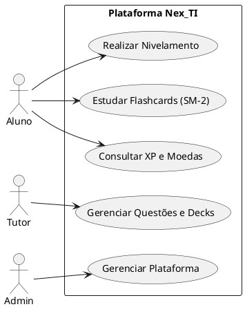
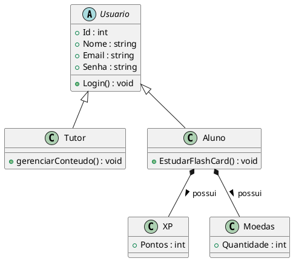
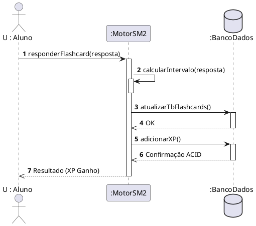

# 🏛️ Guia Astah UML: Diagramas Finais para o PIM III

Para que o seu PIM não sofra descontos de nota por incoerência, os diagramas desenhados no **Astah** devem bater exatamente com o que escrevemos na Etapa 3 (Banco de Dados) e Etapa 4 (C#). 

Como o manual do PIM pede cortes específicos para documentação, aqui estão os **tutoriais passo a passo** para você desenhar as Figuras 13, 14 e 15 no Astah UML, além dos códigos PlantUML correspondentes.

---

## 1️⃣ Figura 13: Diagrama de Casos de Uso (Corte de Atores)

Este diagrama prova que as regras de negócio da **Etapa 1** (Acesso Restrito e Nivelamento) foram aplicadas.

### Como desenhar no Astah:
1. Crie 3 Atores: `Aluno`, `Tutor` e `Admin`.
2. Crie um limite de sistema (System Boundary) chamado `Plataforma Nex_TI`.
3. Adicione os seguintes Casos de Uso dentro do limite:
   - `Realizar Nivelamento`
   - `Estudar Flashcards (SM-2)`
   - `Consultar XP e Moedas`
   - `Gerenciar Questões e Decks`
   - `Gerenciar Plataforma`
4. **Ligações:**
   - O `Aluno` se liga a Nivelamento, Flashcards e Consultar XP.
   - O `Tutor` se liga a Gerenciar Questões e Decks.
   - O `Admin` se liga a Gerenciar Plataforma.

### 💻 Código PlantUML (Geração Rápida)

---

## 2️⃣ Figura 14: Diagrama de Classes (Assinatura Resumida C#)

Este é o diagrama mais crítico. Ele tem que espelhar EXATAMENTE o código `.NET 10` que colocamos no relatório (Etapa 4).

### Como desenhar no Astah:
1. Crie a classe `Usuario`.
   - Marque-a como **Abstract** (O nome ficará em itálico).
   - Adicione os atributos: `+ Id : int`, `+ Nome : string`, `+ Email : string`, `+ Senha : string`.
   - Adicione a operação: `+ Login() : void`.
2. Crie a classe `Aluno` e a classe `Tutor`.
   - Desenhe uma seta de **Generalização (Herança)** (seta branca) de Aluno para Usuario, e de Tutor para Usuario.
   - No `Aluno`, adicione a operação: `+ EstudarFlashCard() : void`.
   - No `Tutor`, adicione a operação: `+ gerenciarConteudo() : void`.
3. Crie as classes `XP` e `Moedas`.
   - `XP` tem o atributo: `+ Pontos : int`.
   - `Moedas` tem o atributo: `+ Quantidade : int`.
4. **Composição:** Desenhe uma seta de Associação Direta (ou Composição com losango preto) do `Aluno` para `XP` e `Moedas`, indicando que o Aluno "tem" XP e Moedas.

### 💻 Código PlantUML (Geração Rápida)

---

## 3️⃣ Figura 15: Diagrama de Sequência (Fluxo de Avaliação)

Este diagrama prova como a Gamificação e o Motor SM-2 operam no tempo e acessam o Banco de Dados SQL Server.

### Como desenhar no Astah:
1. Adicione o Ator `U : Aluno`.
2. Adicione as Linhas de Vida (Lifelines): `:MotorSM2` e `:BancoDados`.
3. **Passo 1:** `U : Aluno` envia a mensagem síncrona `responderFlashcard(resposta)` para `:MotorSM2`.
4. **Passo 2:** `:MotorSM2` executa uma Auto-Mensagem (Activation nele mesmo) chamada `calcularIntervalo(resposta)`.
5. **Passo 3:** `:MotorSM2` envia a mensagem `atualizarTbFlashcards()` para `:BancoDados`.
6. **Passo 4:** `:MotorSM2` envia a mensagem `adicionarXP()` para `:BancoDados`.
7. **Passo 5:** `:BancoDados` retorna uma seta pontilhada `Confirmação ACID` para `:MotorSM2`.
8. **Passo 6:** `:MotorSM2` retorna uma seta pontilhada `Resultado (XP Ganho)` para o `U : Aluno`.

### 💻 Código PlantUML (Geração Rápida)

---
### 🛠️ Próximo Passo
Com esses roteiros, você garante **Nota Máxima** na validação técnica do seu PIM. Basta abrir o Astah, seguir as instruções (ou colar o código em um visualizador PlantUML), exportar as imagens como PNG e colar na sua pasta `assets/diagrams/`!
