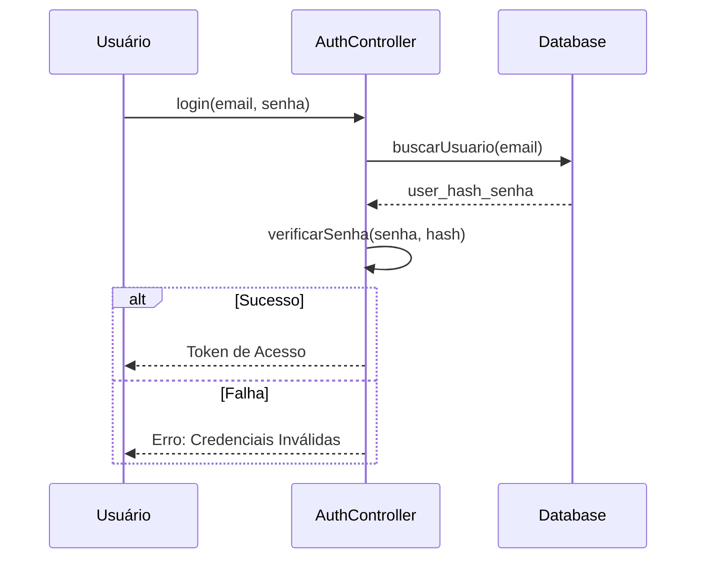
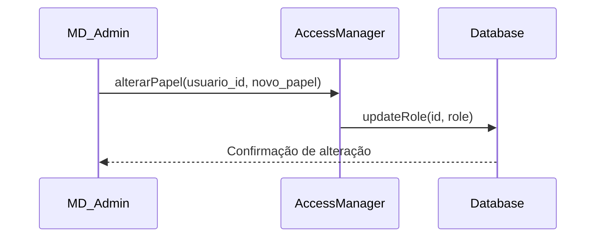
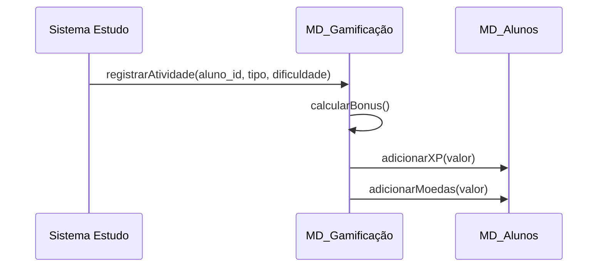
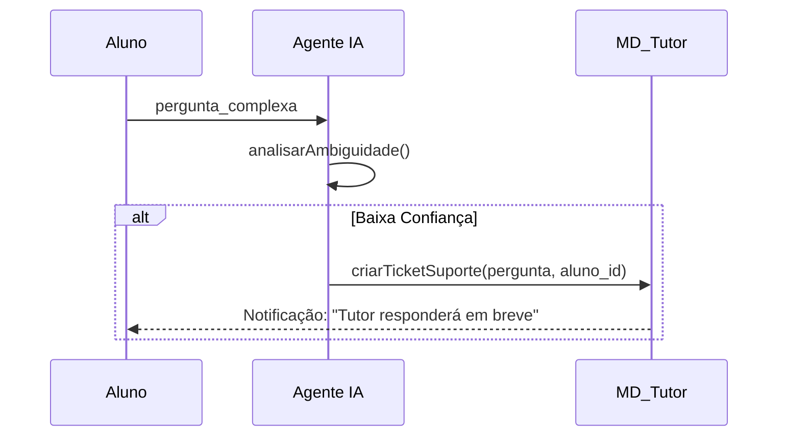

# Detalhamento de Casos de Uso - Sistema Nex_TI

Este documento contém a refatoração técnica de todos os casos de uso identificados no Diagrama Geral, detalhando a estrutura de classes necessária e o fluxo de interação (sequência).

## Índice
1. [Autenticação e Onboarding](#1-autenticação-e-onboarding)
2. [Gestão de Conteúdo e Acessos](#2-gestão-de-conteúdo-e-acessos)
3. [Motor de Estudo e Gamificação](#3-motor-de-estudo-e-gamificação)
4. [Suporte e Inteligência Artificial](#4-suporte-e-inteligência-artificial)
5. [Configurações e Dashboard](#5-configurações-e-dashboard)

---

## 1. Autenticação e Onboarding

### UC01: Realizar Login
- **Descrição**: O usuário acessa o sistema com suas credenciais.
- **Diagrama de Sequência**:

### UC02: Cadastrar Novo Usuário
- **Descrição**: Registro de novos alunos no sistema.
- **Classes Envolvidas**: `MD_Usuários`, `MD_Alunos`, `AuthController`.

### UC03: Realizar Teste de Nivelamento
- **Descrição**: Avaliação inicial para posicionar o aluno.

---

## 2. Gestão de Conteúdo e Acessos

### UC04: Gerenciar Perfis e Acessos

### UC05: Gerenciar Conteúdo das Cartas
- **Ator**: Tutor / Admin.
- **Ações**: Criar, Editar, Excluir Flashcards e Módulos.

---

## 3. Motor de Estudo e Gamificação

### UC09: Estudar Flashcards (Fluxo Principal)
- **Motor**: Algoritmo SM-2.
- **Integração**: Envia dados para o sistema de XP.

### UC12: Atribuir XP e Moedas

---

## 4. Suporte e Inteligência Artificial

### UC08: Consultar Agente Especialista
- **IA**: Processa a dúvida e gera uma resposta baseada na base de conhecimento.

### UC07: Escalar Dúvida para Tutor

---

## 5. Configurações e Dashboard

### UC14: Visualizar Painel de Progresso
- **Visual**: Gráficos de desempenho e status das fases.

### UC15: Ajustar Acessibilidade
- **Global**: Persiste as preferências de interface do usuário.

---

> [!IMPORTANT]
> Cada diagrama de sequência pressupõe uma camada de persistência (Banco de Dados) e uma camada de controle (Controller/Service) seguindo o padrão MVC.
