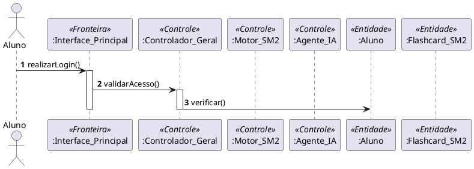

# 📘 Guia de Modelagem Astah: Diagrama de Sequência Global (Nex_TI)

## 🎯 Objetivo
Visualizar a interação completa entre as camadas do sistema, desde a autenticação até o ciclo de estudo com IA e Gamificação.

## 🚀 Passo a Passo no Astah UML

### 1️⃣ Preparação das Linhas de Vida (Lifelines)
No Astah, clique no ícone de **Sequence Diagram** e adicione os seguintes elementos:

| Nome da Instância | Classe Associada | Estereótipo |
| :--- | :--- | :--- |
| `User` | (Ator) | - |
| `:Interface_Principal` | `Interface_Principal` | `<<Fronteira>>` |
| `:Controlador_Geral` | `Controlador_Geral` | `<<Controle>>` |
| `:Motor_SM2` | `Motor_SM2` | `<<Controle>>` |
| `:Agente_IA` | `Agente_IA` | `<<Controle>>` |
| `:Aluno` | `Aluno` | `<<Entidade>>` |
| `:Flashcard_SM2` | `Flashcard_SM2` | `<<Entidade>>` |

> [!TIP]
> Para adicionar o estereótipo no Astah: Selecione a Lifeline -> Aba **Stereotype** (rodapé) -> Botão **Add** -> Digite `Fronteira`, `Controle` ou `Entidade`.

### 2️⃣ Fluxo de Autenticação
1. Desenhe uma mensagem de **User** para **:Interface_Principal**: `realizarLogin(credenciais)`.
2. Da interface para o **Controlador**: `validarAcesso(credenciais)`.
3. O controlador consulta a entidade **:Aluno**: `verificarCredenciais()`.
4. Use uma linha tracejada (`Reply Message`) para o retorno de sucesso.

### 3️⃣ Ciclo SM-2 e Gamificação
1. Represente a chamada `informarFeedback(facilidade)`.
2. O **Controlador** aciona o **Motor_SM2** para cálculo: `calcularNovoIntervalo()`.
3. O **Controlador** atualiza a **Entidade Flashcard**.
4. **Nota de Gamificação:** Use o elemento `Note` do Astah para indicar a atribuição de XP no Controlador.

### 4️⃣ Integração com IA
1. Adicione a interação de dúvida onde o **Controlador** delega para o **:Agente_IA**.
2. Represente a auto-chamada (`Self-Message`) no Agente IA: `gerarExplicacaoContextual()`.

---

## 📐 Referência Premium (PlantUML)

Use o código abaixo como guia lógico:

---
*Manual gerado por Antigravity AI para o projeto PIM III - Nex_TI.*
