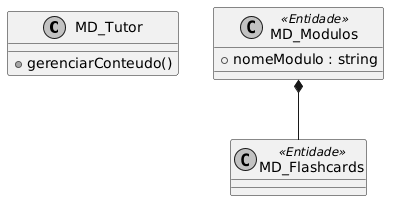
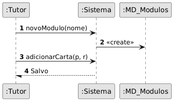
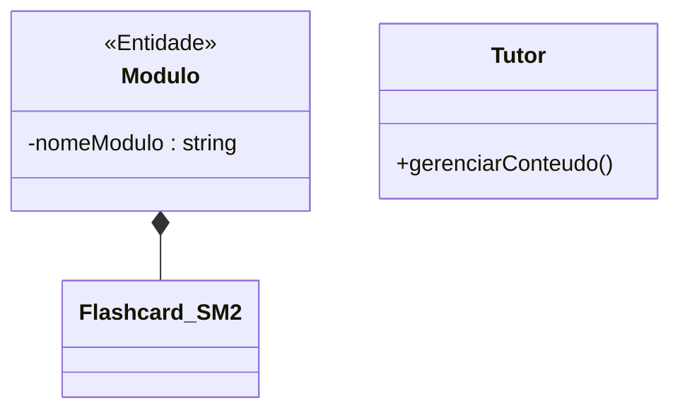
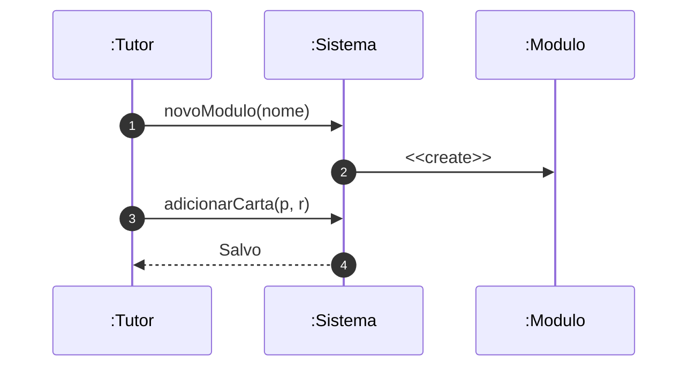

# 📘 Guia de Modelagem Astah (Fiel à v10.x): Gerenciar Conteúdo e Cartas

## 🎯 Objetivo
Criação de flashcards e módulos.

## 🌊 Fluxos (Normal e Alternativo)
- **Fluxo Normal:** O Tutor acessa o repositório de disciplinas, cria um novo "Deck", cadastra os flashcards preenchendo as informações de "Frente" (Pergunta) e "Verso" (Resposta/Explicação) e publica o módulo para os alunos.
- **Fluxo Alternativo:** O Tutor tenta excluir um Deck que já está ativamente sendo estudado por vários alunos. O sistema emite um alerta de dependência (ON DELETE) e sugere apenas ocultar (arquivar) o conteúdo para novos alunos.

> [!IMPORTANT]
> Dica Astah: A Composição no Astah é o ícone do losango preto.

## 🚀 Tutorial Passo a Passo Detalhado (Interface Astah)

### 1️⃣ Diagrama de Classe (Estrutura)
   - [ ] 1. **Crie 'Modulo' e 'Flashcard_SM2'.**
   - [ ] 2. **Ligue com 'Composição' (losango no Módulo).**
   - [ ] 3. **Atributo em Módulo: '- nomeModulo : string'.**

**Como configurar no Astah:** Para adicionar o Estereótipo (ex: <<Entidade>>), selecione a classe, vá na aba **Stereotype** (na base da tela) e clique em **Add**.

### 2️⃣ Diagrama de Sequência (Processo)
   - [ ] 1. **O Tutor solicita 'novoModulo()' ao Sistema.**
   - [ ] 2. **O Sistema cria (Create) o objeto 'Modulo'.**
   - [ ] 3. **O Tutor adiciona cartas via 'adicionarCarta()'.**

**Dica de Notação:** Note que os nomes das Linhas de Vida agora começam com dois pontos (ex: `:Controlador`), indicando que são instâncias anônimas da classe.

---

## 🛠️ Artefatos de Alta Fidelidade (PlantUML)

### Diagrama de Classe (Premium)

### Diagrama de Sequência (Premium)

---

## 📊 Referência Visual (Estilo Astah UML)
### Diagrama de Classe

### Diagrama de Sequência

---
*Este manual foi otimizado para a versão 10.1.0 do Astah UML.*
---

## 🏛️ Contexto Arquitetural
Este Caso de Uso integra a arquitetura modular do sistema Nex_TI. Para uma visão das relações entre todas as classes, consulte o [Diagrama de Classes Global](./Diagrama_Classes_Global.png).

---

[⬅️ Voltar para o Dashboard Visual](../../01_Relatorios_e_Dashboard/DASHBOARD_VISUAL.md)
