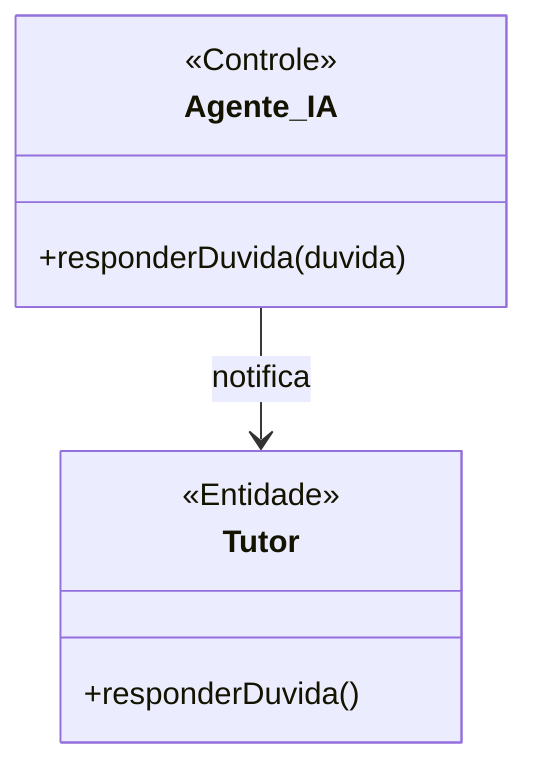
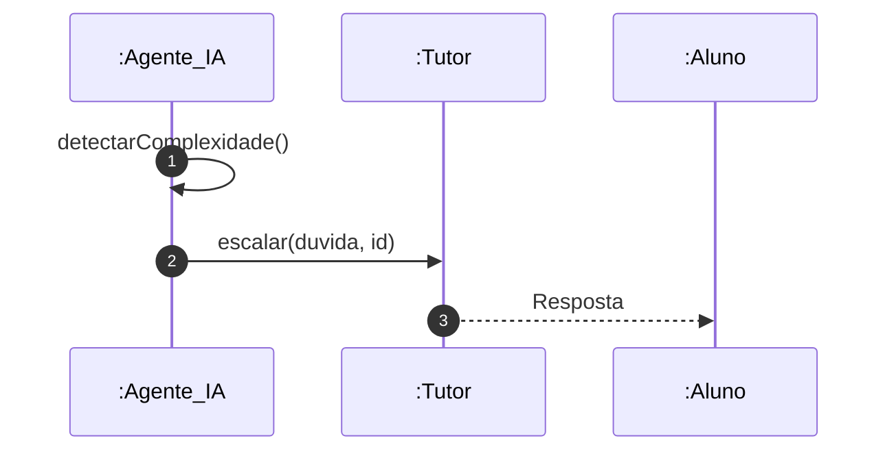

# 📘 Guia de Modelagem Astah (Fiel à v10.x): Escalar Dúvida para Tutor

## 🎯 Objetivo
Transferência IA -> Humano.

## 🌊 Fluxos (Normal e Alternativo)
- **Fluxo Normal:** Durante uma sessão de estudos, o aluno clica no botão "Tenho uma dúvida" no flashcard. Ele digita a pergunta e envia. O sistema notifica o Tutor responsável pela área de conhecimento. O Tutor responde e o aluno é notificado.
- **Fluxo Alternativo:** O prazo de resposta do Tutor (SLA) é ultrapassado. O sistema marca a dúvida com a flag de "Prioridade Alta" e dispara um e-mail de alerta para a coordenação (Admin).

> [!IMPORTANT]
> Dica Astah: Agente_IA é um <<Controle>>.

## 🚀 Tutorial Passo a Passo Detalhado (Interface Astah)

### 1️⃣ Diagrama de Classe (Estrutura)
   - [ ] 1. **Crie 'Agente_IA' (<<Controle>>) com '+ responderDuvida()'.**
   - [ ] 2. **Crie 'Tutor' com '+ responderDuvida()'.**
   - [ ] 3. **Associação simples entre os dois.**

**Como configurar no Astah:** Para adicionar o Estereótipo (ex: <<Entidade>>), selecione a classe, vá na aba **Stereotype** (na base da tela) e clique em **Add**.

### 2️⃣ Diagrama de Sequência (Processo)
   - [ ] 1. **Agente_IA detecta complexidade.**
   - [ ] 2. **Agente_IA envia 'escalar(duvida)' para :Tutor.**
   - [ ] 3. **Tutor responde ao Aluno.**

**Dica de Notação:** Note que os nomes das Linhas de Vida agora começam com dois pontos (ex: `:Controlador`), indicando que são instâncias anônimas da classe.

---

## 📊 Referência Visual (Estilo Astah UML)
### Diagrama de Classe

### Diagrama de Sequência

---
*Este manual foi otimizado para a versão 10.1.0 do Astah UML.*