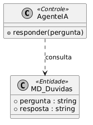
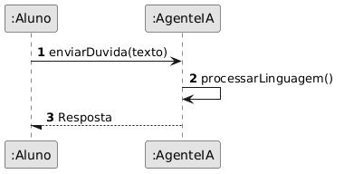
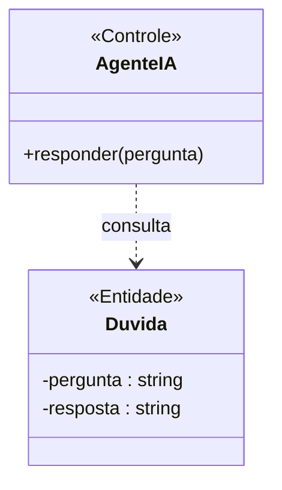

# 📘 Guia de Modelagem Astah (Fiel à v10.x): Consultar Agente IA

## 🎯 Objetivo
Interação instantânea.

## 🌊 Fluxos (Normal e Alternativo)
- **Fluxo Normal:** O aluno solicita ajuda à IA no chat. A IA (Agente Especialista) recebe a dúvida, identifica o contexto do flashcard atual através de Processamento de Linguagem Natural (NLP) e retorna uma explicação detalhada e pedagógica.
- **Fluxo Alternativo:** A IA não consegue interpretar a pergunta ou o aluno faz uma pergunta muito fora de contexto. A IA solicita reformulação ou sugere automaticamente "Escalar a dúvida para o Tutor humano".

> [!IMPORTANT]
> Dica Astah: Represente Duvida como <<Entidade>>.

## 🚀 Tutorial Passo a Passo Detalhado (Interface Astah)

### 1️⃣ Diagrama de Classe (Estrutura)
   - [ ] 1. **Crie 'AgenteIA' com '+ responder()'.**
   - [ ] 2. **Crie 'Duvida' com '- pergunta : string' e '+ resposta : string'.**
   - [ ] 3. **Dependência da IA para Duvida.**

**Como configurar no Astah:** Para adicionar o Estereótipo (ex: <<Entidade>>), selecione a classe, vá na aba **Stereotype** (na base da tela) e clique em **Add**.

### 2️⃣ Diagrama de Sequência (Processo)
   - [ ] 1. **Aluno envia dúvida para :AgenteIA.**
   - [ ] 2. **AgenteIA processa linguagem natural.**
   - [ ] 3. **AgenteIA retorna resposta ao Aluno.**

**Dica de Notação:** Note que os nomes das Linhas de Vida agora começam com dois pontos (ex: `:Controlador`), indicando que são instâncias anônimas da classe.

---

## 🛠️ Artefatos de Alta Fidelidade (PlantUML)

### Diagrama de Classe (Premium)

### Diagrama de Sequência (Premium)

---

## 📊 Referência Visual (Estilo Astah UML)
### Diagrama de Classe

### Diagrama de Sequência

---
*Este manual foi otimizado para a versão 10.1.0 do Astah UML.*
---

## 🏛️ Contexto Arquitetural
Este Caso de Uso integra a arquitetura modular do sistema Nex_TI. Para uma visão das relações entre todas as classes, consulte o [Diagrama de Classes Global](./Diagrama_Classes_Global.png).

---

[⬅️ Voltar para o Dashboard Visual](../../01_Relatorios_e_Dashboard/DASHBOARD_VISUAL.md)
