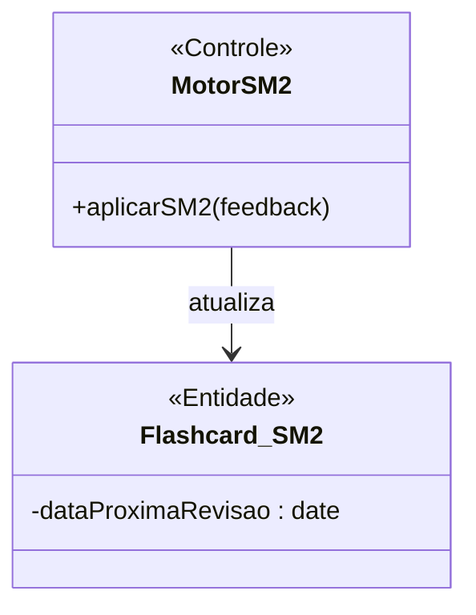
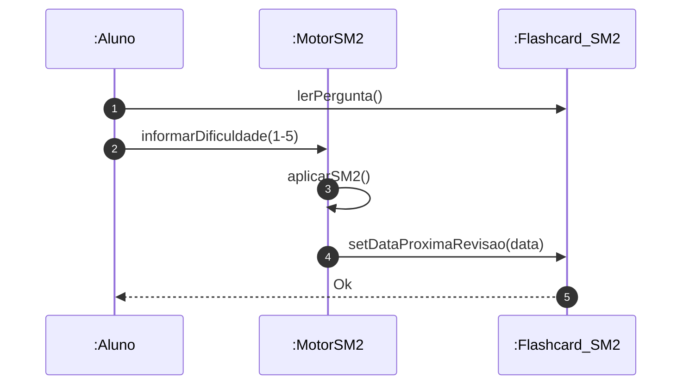

# 📘 Guia de Modelagem Astah (Fiel à v10.x): Estudar Flashcards (SM-2)

## 🎯 Objetivo
Repetição espaçada.

## 🌊 Fluxos (Normal e Alternativo)
- **Fluxo Normal:** O aluno abre um deck e o sistema exibe a frente da carta. O aluno mentaliza a resposta e clica em "Mostrar Verso". O aluno autoavalia sua facilidade (Fácil, Bom, Difícil). O motor SM-2 recalcula e agenda a data da próxima revisão do card. (Aciona o *include* de Atribuir XP).
- **Fluxo Alternativo:** O aluno conclui todos os cards agendados para o dia de hoje. O sistema informa que as metas diárias foram cumpridas e sugere descanso ou revisar módulos opcionais.

> [!IMPORTANT]
> Dica Astah: No Astah, use 'Self-Message' para o algoritmo SM-2.

## 🚀 Tutorial Passo a Passo Detalhado (Interface Astah)

### 1️⃣ Diagrama de Classe (Estrutura)
   - [ ] 1. **Crie 'MotorSM2' (<<Controle>>) e 'Flashcard_SM2'.**
   - [ ] 2. **Atributos no Flashcard: '- dataProximaRevisao : date'.**
   - [ ] 3. **Associação do Motor para o Flashcard.**

**Como configurar no Astah:** Para adicionar o Estereótipo (ex: <<Entidade>>), selecione a classe, vá na aba **Stereotype** (na base da tela) e clique em **Add**.

### 2️⃣ Diagrama de Sequência (Processo)
   - [ ] 1. **Aluno lê pergunta.**
   - [ ] 2. **Aluno informa dificuldade (1-5) ao :MotorSM2.**
   - [ ] 3. **Motor aplica algoritmo e atualiza data no Flashcard_SM2.**

**Dica de Notação:** Note que os nomes das Linhas de Vida agora começam com dois pontos (ex: `:Controlador`), indicando que são instâncias anônimas da classe.

---

## 📊 Referência Visual (Estilo Astah UML)
### Diagrama de Classe

### Diagrama de Sequência

---
*Este manual foi otimizado para a versão 10.1.0 do Astah UML.*