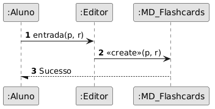
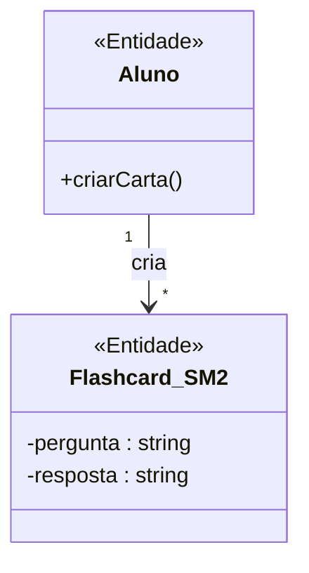
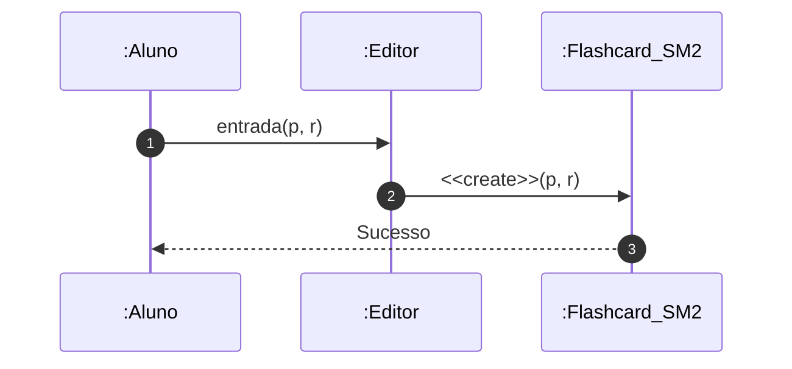

# 📘 Guia de Modelagem Astah (Fiel à v10.x): Criar Flashcards

## 🎯 Objetivo
Personalização de deck.

## 🌊 Fluxos (Normal e Alternativo)
- **Fluxo Normal:** O aluno deseja aprofundar um tema específico e clica em "Criar Card Pessoal". Preenche frente e verso e salva no seu deck privado, que agora também fará parte da rotina de repetição espaçada.
- **Fluxo Alternativo:** O aluno tenta salvar o card deixando o verso em branco. O sistema desabilita o botão de salvar e destaca o campo obrigatório em vermelho.

> [!IMPORTANT]
> Dica Astah: Editor é uma classe de <<Fronteira>>.

## 🚀 Tutorial Passo a Passo Detalhado (Interface Astah)

### 1️⃣ Diagrama de Classe (Estrutura)
   - [ ] 1. **Crie 'Aluno' e 'Flashcard_SM2'.**
   - [ ] 2. **Método em Aluno: '+ criarCarta()'.**
   - [ ] 3. **Associação 1..*.**

**Como configurar no Astah:** Para adicionar o Estereótipo (ex: <<Entidade>>), selecione a classe, vá na aba **Stereotype** (na base da tela) e clique em **Add**.

### 2️⃣ Diagrama de Sequência (Processo)
   - [ ] 1. **Aluno usa :Editor para digitar dados.**
   - [ ] 2. **Editor envia dados para criar :Flashcard_SM2.**
   - [ ] 3. **Confirmação de salvamento.**

**Dica de Notação:** Note que os nomes das Linhas de Vida agora começam com dois pontos (ex: `:Controlador`), indicando que são instâncias anônimas da classe.

---

## 🛠️ Artefatos de Alta Fidelidade (PlantUML)

### Diagrama de Classe (Premium)

### Diagrama de Sequência (Premium)

---

## 🛠️ Artefatos de Alta Fidelidade (PlantUML)

### Diagrama de Classe (Premium)

### Diagrama de Sequência (Premium)

---

## 📊 Referência Visual (Estilo Astah UML)
### Diagrama de Classe

### Diagrama de Sequência

---
*Este manual foi otimizado para a versão 10.1.0 do Astah UML.*
---

## 🏛️ Contexto Arquitetural
Este Caso de Uso integra a arquitetura modular do sistema Nex_TI. Para uma visão das relações entre todas as classes, consulte o [Diagrama de Classes Global](./Diagrama_Classes_Global.png).

---

[⬅️ Voltar para o Dashboard Visual](../../01_Relatorios_e_Dashboard/DASHBOARD_VISUAL.md)
