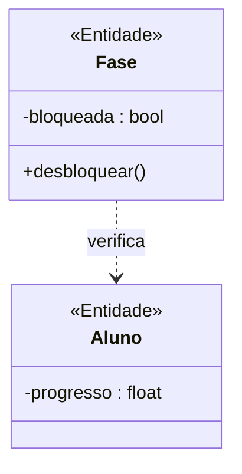
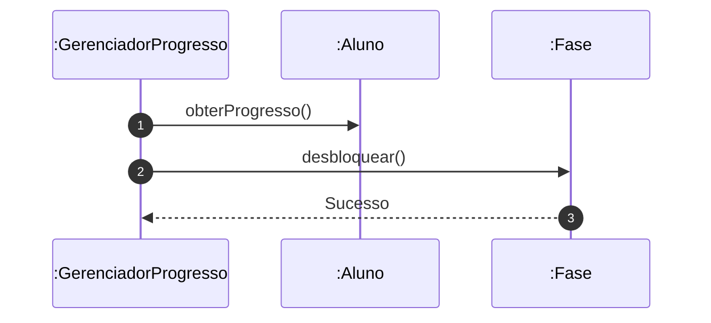

# 📘 Guia de Modelagem Astah (Fiel à v10.x): Desbloquear Fases e Módulos

## 🎯 Objetivo
Progressão condicionada.

## 🌊 Fluxos (Normal e Alternativo)
- **Fluxo Normal:** O aluno acessa a "Loja" virtual. Ele escolhe um módulo avançado restrito, verifica que possui moedas suficientes e clica em "Comprar". O sistema deduz as moedas do saldo e libera o acesso permanente ao módulo.
- **Fluxo Alternativo:** O aluno tenta desbloquear um módulo, mas seu saldo de moedas virtuais é insuficiente. O botão de compra permanece inativo e o sistema exibe quanto falta para adquirir o item.

> [!IMPORTANT]
> Dica Astah: Use Dependência para mostrar verificação de progresso.

## 🚀 Tutorial Passo a Passo Detalhado (Interface Astah)

### 1️⃣ Diagrama de Classe (Estrutura)
   - [ ] 1. **Crie 'Fase' com '- bloqueada : bool'.**
   - [ ] 2. **Crie 'GerenciadorProgresso' (<<Controle>>).**
   - [ ] 3. **Dependência do Gerenciador para Aluno e Fase.**

**Como configurar no Astah:** Para adicionar o Estereótipo (ex: <<Entidade>>), selecione a classe, vá na aba **Stereotype** (na base da tela) e clique em **Add**.

### 2️⃣ Diagrama de Sequência (Processo)
   - [ ] 1. **Gerenciador pede progresso ao Aluno.**
   - [ ] 2. **Se ok, chama 'desbloquear()' na :Fase.**
   - [ ] 3. **Fase muda estado para liberada.**

**Dica de Notação:** Note que os nomes das Linhas de Vida agora começam com dois pontos (ex: `:Controlador`), indicando que são instâncias anônimas da classe.

---

## 📊 Referência Visual (Estilo Astah UML)
### Diagrama de Classe

### Diagrama de Sequência

---
*Este manual foi otimizado para a versão 10.1.0 do Astah UML.*