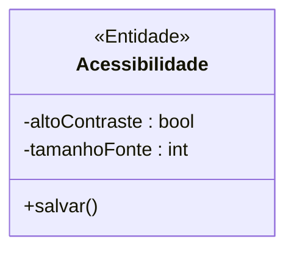
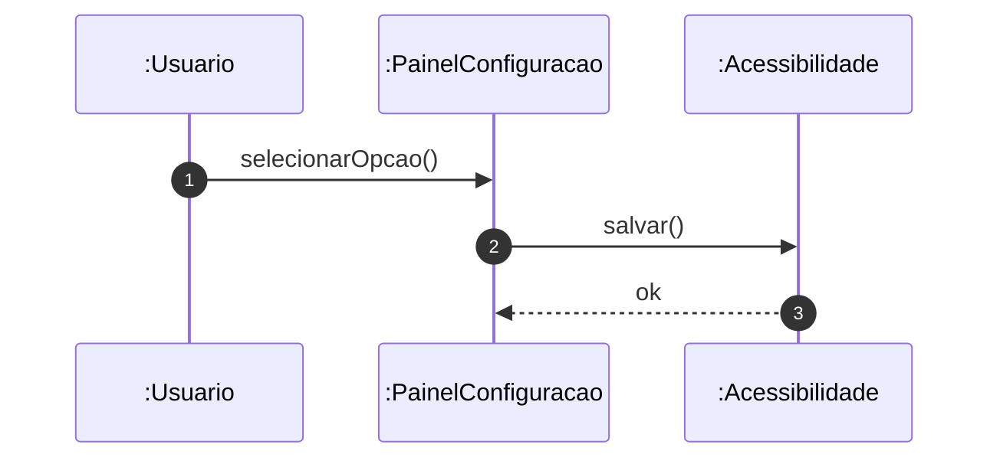

# 📘 Guia de Modelagem Astah (Fiel à v10.x): Ajustar Acessibilidade

## 🎯 Objetivo
Personalização.

## 🌊 Fluxos (Normal e Alternativo)
- **Fluxo Normal:** O usuário acessa o menu de configurações globais de interface e seleciona opções como "Aumentar Fonte" ou "Ativar Alto Contraste". O sistema aplica as regras de CSS na hora e salva a preferência na sessão ou banco de dados do usuário.
- **Fluxo Alternativo:** O usuário ativa uma configuração que conflita com o layout da tela. Ele clica em "Restaurar Padrões", e o sistema limpa as injeções de estilo, retornando o layout à folha de estilo original.

> [!IMPORTANT]
> Dica Astah: Acessibilidade é uma <<Entidade>>.

## 🚀 Tutorial Passo a Passo Detalhado (Interface Astah)

### 1️⃣ Diagrama de Classe (Estrutura)
   - [ ] 1. **Crie 'Acessibilidade' com '- altoContraste : bool' e '- tamanhoFonte : int'.**
   - [ ] 2. **Método: '+ salvar()'.**

**Como configurar no Astah:** Para adicionar o Estereótipo (ex: <<Entidade>>), selecione a classe, vá na aba **Stereotype** (na base da tela) e clique em **Add**.

### 2️⃣ Diagrama de Sequência (Processo)
   - [ ] 1. **Usuario interage com :PainelConfiguracao.**
   - [ ] 2. **Painel envia 'salvar()' para :Acessibilidade.**
   - [ ] 3. **Interface atualiza.**

**Dica de Notação:** Note que os nomes das Linhas de Vida agora começam com dois pontos (ex: `:Controlador`), indicando que são instâncias anônimas da classe.

---

## 📊 Referência Visual (Estilo Astah UML)
### Diagrama de Classe

### Diagrama de Sequência

---
*Este manual foi otimizado para a versão 10.1.0 do Astah UML.*