# 🚀 Painel de Modelagem: 15 Casos de Uso

Este documento centraliza os **Diagramas de Classe e Sequência** individuais em Português.

## 📑 Índice de Casos de Uso
- [Realizar Login](#uc01-realizar-login)
- [Cadastrar Usuário](#uc02-cadastrar-usuario)
- [Teste de Nivelamento](#uc03-realizar-teste-nivelamento)
- [Gerenciar Perfis e Acessos](#uc04-gerenciar-perfis-acessos)
- [Gerenciar Conteúdo e Cartas](#uc05-gerenciar-conteudo-cartas)
- [Acompanhar Desempenho](#uc06-acompanhar-desempenho)
- [Escalar Dúvida para Tutor](#uc07-escalar-duvida-tutor)
- [Consultar Agente IA](#uc08-consultar-agente-ia)
- [Estudar Flashcards (SM-2)](#uc09-estudar-flashcards)
- [Criar Flashcards](#uc10-criar-flashcards)
- [Realizar Simulado ENADE](#uc11-realizar-simulado-enade)
- [Atribuir XP e Moedas](#uc12-atribuir-xp-moedas)
- [Desbloquear Fases e Módulos](#uc13-desbloquear-fases-modulos)
- [Visualizar Painel de Progresso](#uc14-visualizar-painel-progresso)
- [Ajustar Acessibilidade](#uc15-ajustar-acessibilidade)

---

## UC01_Realizar_Login - Realizar Login
**Objetivo:** Acesso seguro do usuário ao sistema através de validação de credenciais.

### 📐 Diagramas Dedicados
#### Diagrama de Classe
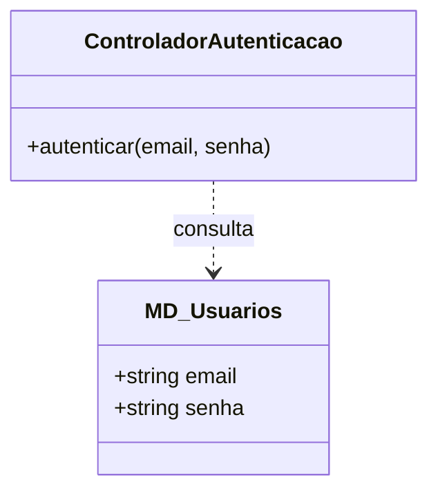
#### Diagrama de Sequência
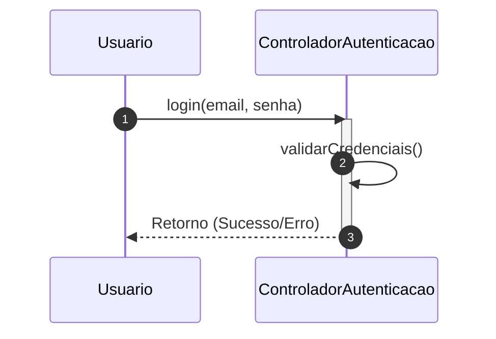

[👉 Abrir Tutorial de Execução Detalhado](../02_Modelagem_UML_Astah/UC01_Realizar_Login/README.md)

---

## UC02_Cadastrar_Usuario - Cadastrar Usuário
**Objetivo:** Registro de novos alunos com inicialização automática de perfil de gamificação.

### 📐 Diagramas Dedicados
#### Diagrama de Classe
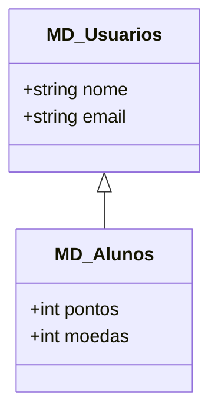
#### Diagrama de Sequência
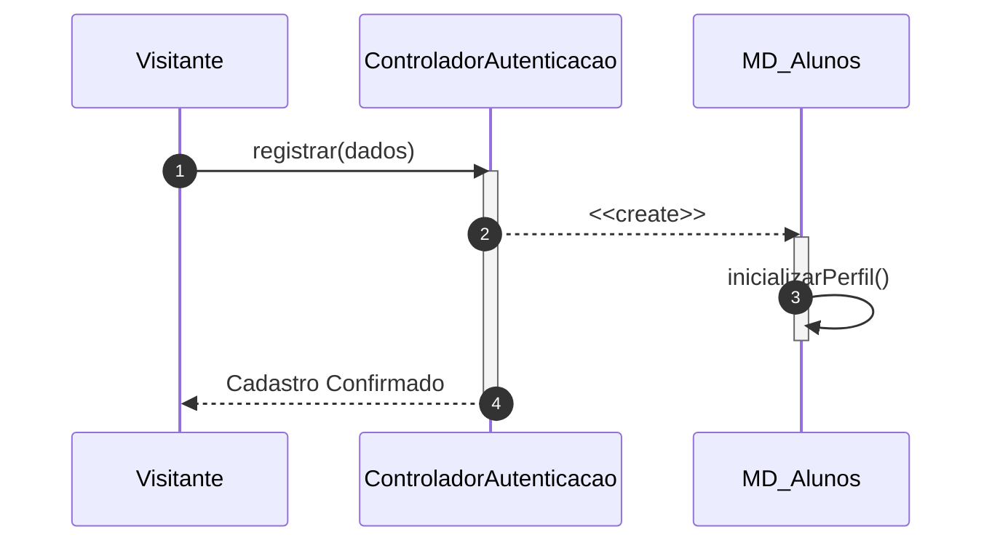

[👉 Abrir Tutorial de Execução Detalhado](../02_Modelagem_UML_Astah/UC02_Cadastrar_Usuario/README.md)

---

## UC03_Realizar_Teste_Nivelamento - Teste de Nivelamento
**Objetivo:** Avaliação diagnóstica para posicionamento do aluno no mapa de conhecimento.

### 📐 Diagramas Dedicados
#### Diagrama de Classe
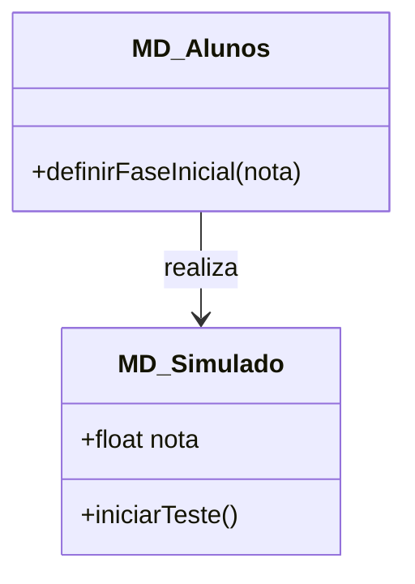
#### Diagrama de Sequência
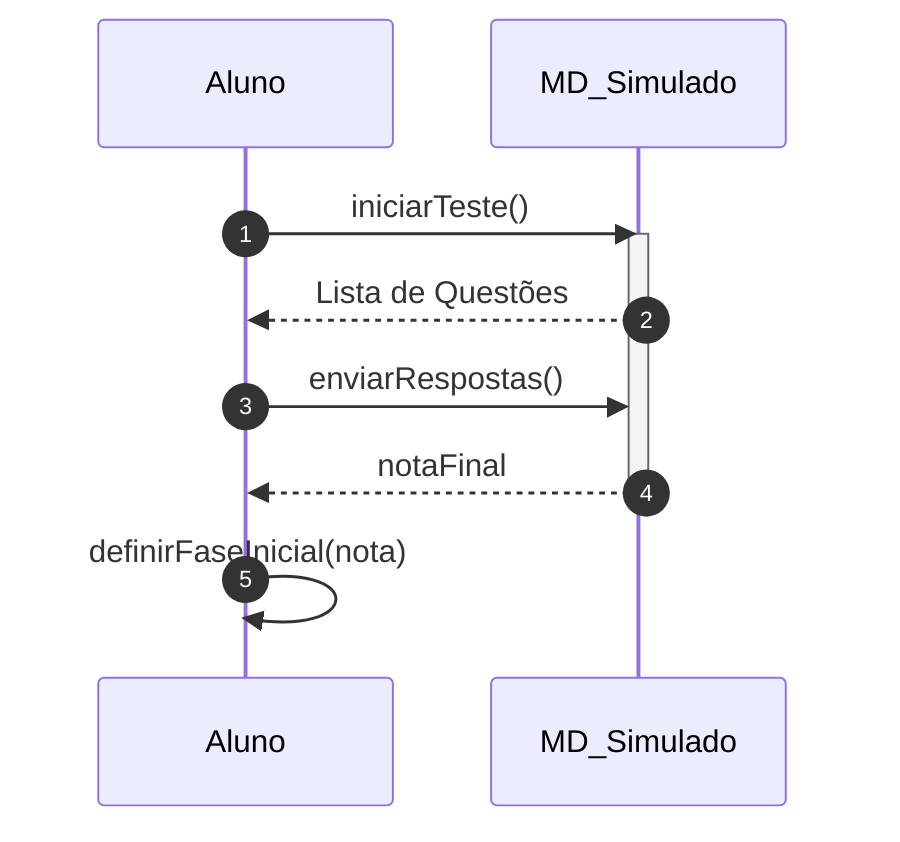

[👉 Abrir Tutorial de Execução Detalhado](../02_Modelagem_UML_Astah/UC03_Realizar_Teste_Nivelamento/README.md)

---

## UC04_Gerenciar_Perfis_Acessos - Gerenciar Perfis e Acessos
**Objetivo:** Administração de papéis (Admin, Tutor, Aluno) e permissões de sistema.

### 📐 Diagramas Dedicados
#### Diagrama de Classe
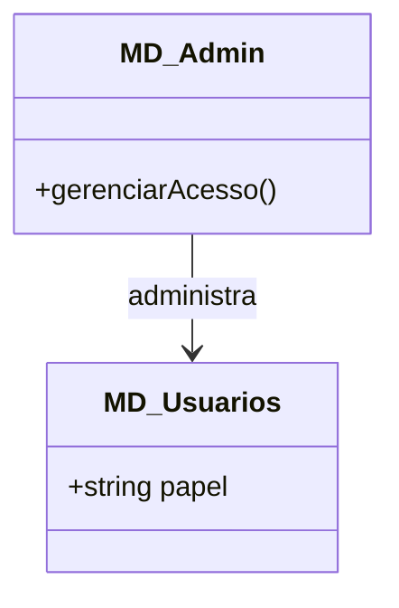
#### Diagrama de Sequência
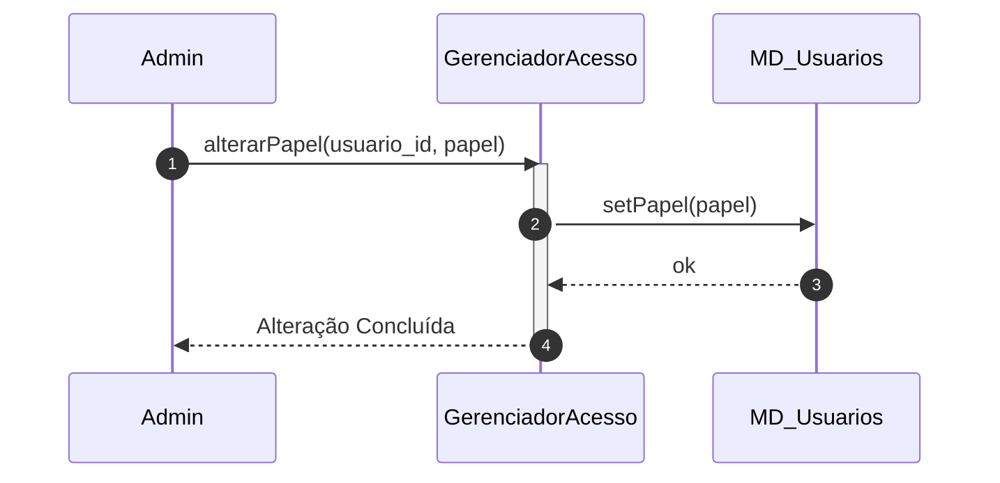

[👉 Abrir Tutorial de Execução Detalhado](../02_Modelagem_UML_Astah/UC04_Gerenciar_Perfis_Acessos/README.md)

---

## UC05_Gerenciar_Conteudo_Cartas - Gerenciar Conteúdo e Cartas
**Objetivo:** Criação e manutenção de flashcards e módulos de estudo pelos tutores.

### 📐 Diagramas Dedicados
#### Diagrama de Classe
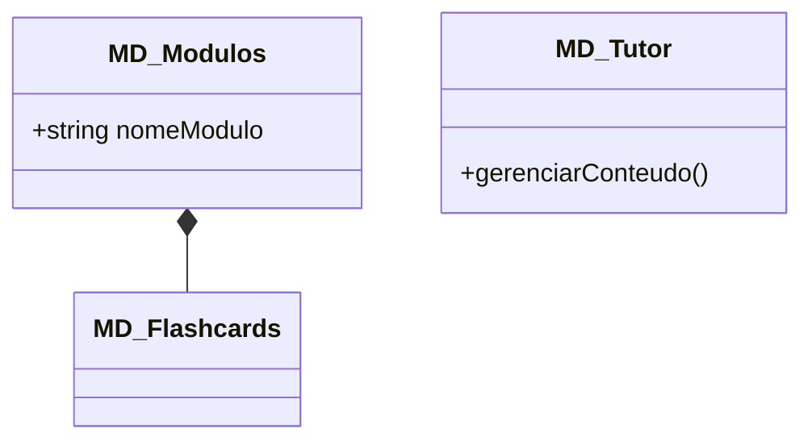
#### Diagrama de Sequência
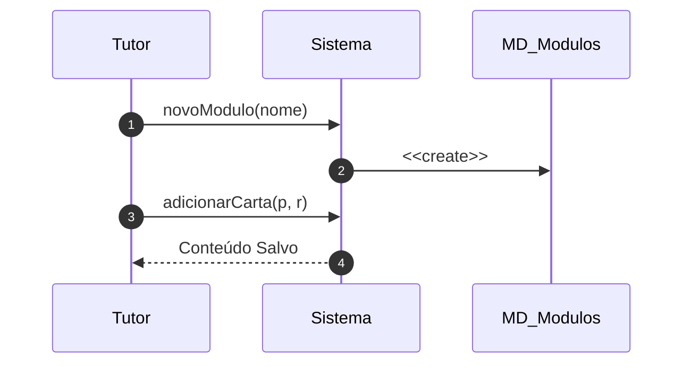

[👉 Abrir Tutorial de Execução Detalhado](../02_Modelagem_UML_Astah/UC05_Gerenciar_Conteudo_Cartas/README.md)

---

## UC06_Acompanhar_Desempenho - Acompanhar Desempenho
**Objetivo:** Visualização de métricas de progresso e engajamento dos alunos.

### 📐 Diagramas Dedicados
#### Diagrama de Classe
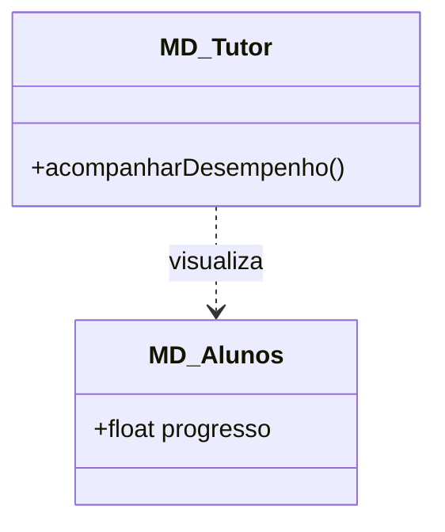
#### Diagrama de Sequência
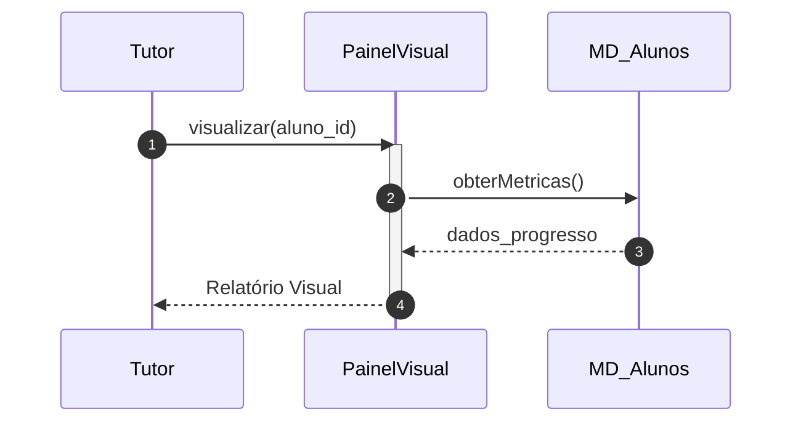

[👉 Abrir Tutorial de Execução Detalhado](../02_Modelagem_UML_Astah/UC06_Acompanhar_Desempenho/README.md)

---

## UC07_Escalar_Duvida_Tutor - Escalar Dúvida para Tutor
**Objetivo:** Transferência de suporte da IA para um tutor humano quando a complexidade excede o limite do agente.

### 📐 Diagramas Dedicados
#### Diagrama de Classe
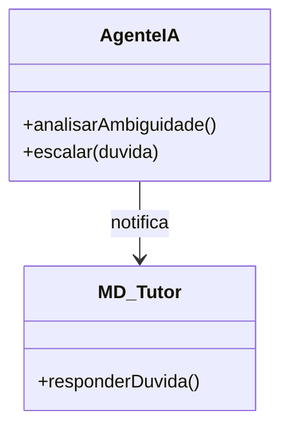
#### Diagrama de Sequência
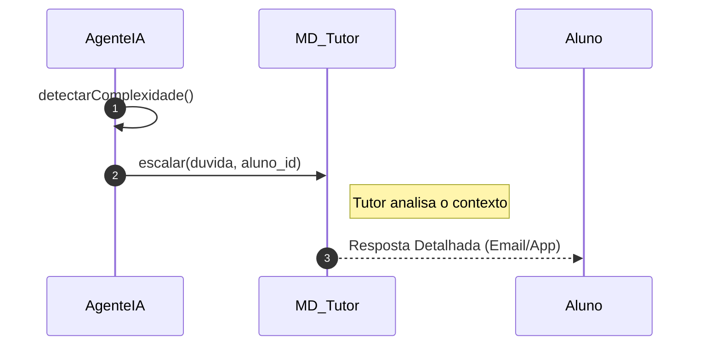

[👉 Abrir Tutorial de Execução Detalhado](../02_Modelagem_UML_Astah/UC07_Escalar_Duvida_Tutor/README.md)

---

## UC08_Consultar_Agente_IA - Consultar Agente IA
**Objetivo:** Interação instantânea com o especialista virtual para dúvidas pontuais.

### 📐 Diagramas Dedicados
#### Diagrama de Classe
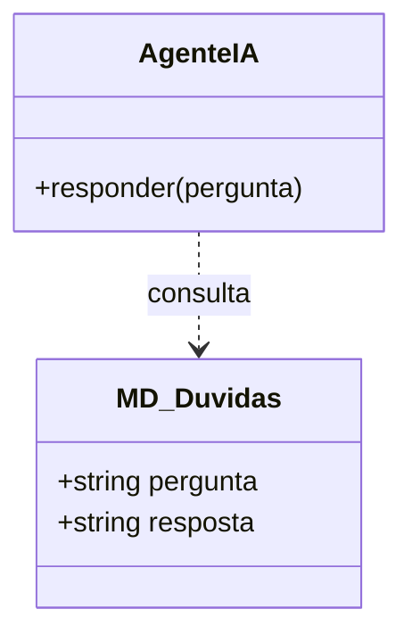
#### Diagrama de Sequência
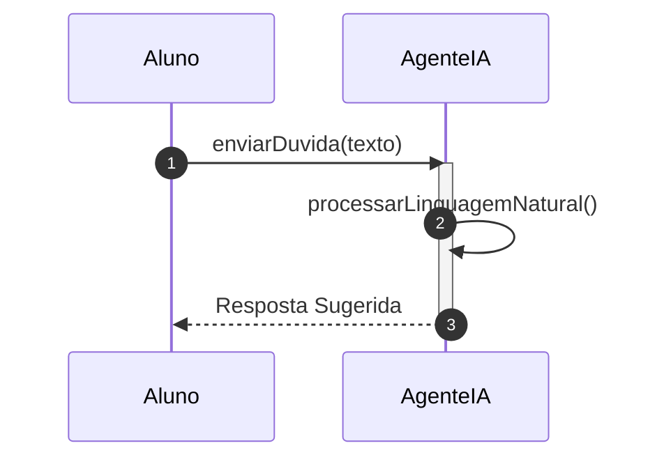

[👉 Abrir Tutorial de Execução Detalhado](../02_Modelagem_UML_Astah/UC08_Consultar_Agente_IA/README.md)

---

## UC09_Estudar_Flashcards - Estudar Flashcards (SM-2)
**Objetivo:** Ciclo de estudo principal utilizando o algoritmo de repetição espaçada.

### 📐 Diagramas Dedicados
#### Diagrama de Classe
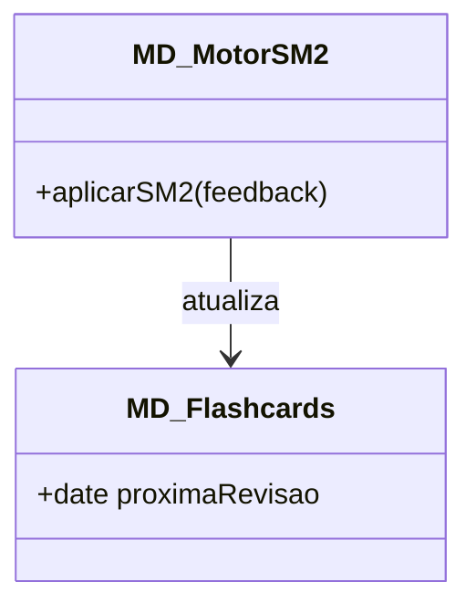
#### Diagrama de Sequência
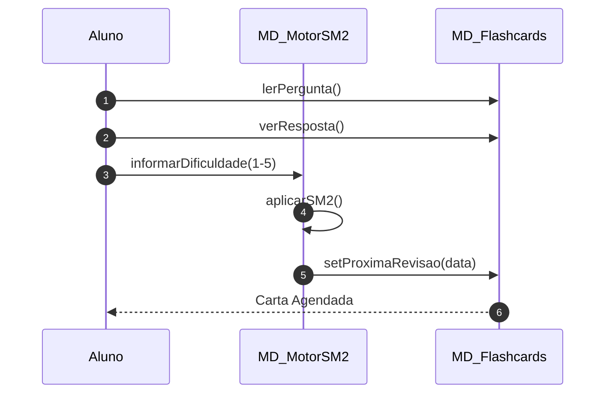

[👉 Abrir Tutorial de Execução Detalhado](../02_Modelagem_UML_Astah/UC09_Estudar_Flashcards/README.md)

---

## UC10_Criar_Flashcards - Criar Flashcards
**Objetivo:** Funcionalidade que permite ao aluno personalizar seu próprio deck de estudos.

### 📐 Diagramas Dedicados
#### Diagrama de Classe
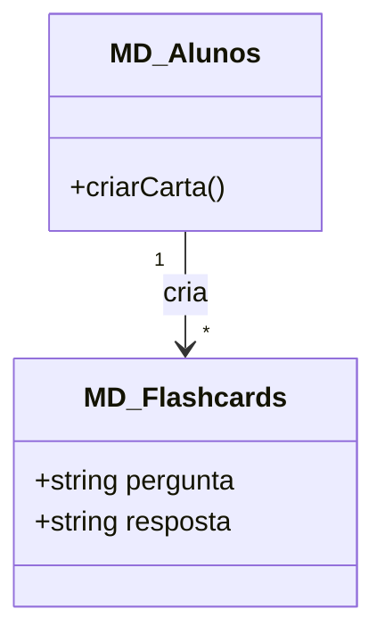
#### Diagrama de Sequência
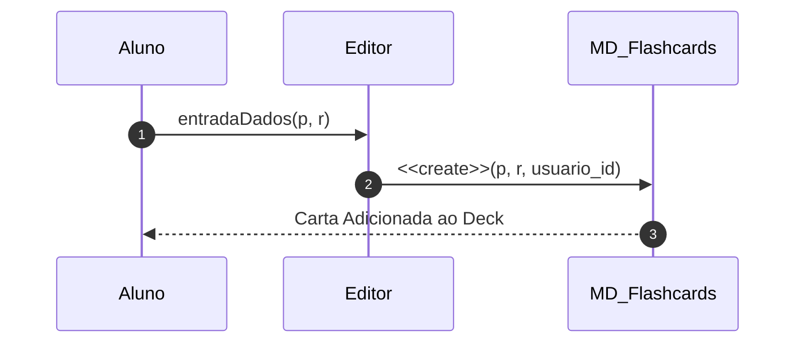

[👉 Abrir Tutorial de Execução Detalhado](../02_Modelagem_UML_Astah/UC10_Criar_Flashcards/README.md)

---

## UC11_Realizar_Simulado_ENADE - Realizar Simulado ENADE
**Objetivo:** Treinamento intensivo com tempo controlado e questões de exames oficiais.

### 📐 Diagramas Dedicados
#### Diagrama de Classe
```mermaid
classDiagram
    class MD_Simulado {
        +int tempoRestante
        +iniciarTeste()
        +calcularNota()
    }
    class Questao {
        +string texto
    }
    MD_Simulado "1" *-- "*" Questao
```
#### Diagrama de Sequência
```mermaid
sequenceDiagram
    autonumber
    participant A as Aluno
    participant S as MD_Simulado
    participant T as Temporizador
    A->>S: iniciarTeste()
    activate S
    S->>T: iniciar(120min)
    loop Cada Questão
        A->>S: responder(id, opcao)
    end
    A->>S: finalizar()
    S->>T: parar()
    S-->>A: Nota e Feedback
    deactivate S
```

[👉 Abrir Tutorial de Execução Detalhado](../02_Modelagem_UML_Astah/UC11_Realizar_Simulado_ENADE/README.md)

---

## UC12_Atribuir_XP_Moedas - Atribuir XP e Moedas
**Objetivo:** Motor de recompensas automático baseado na conclusão de atividades.

### 📐 Diagramas Dedicados
#### Diagrama de Classe
```mermaid
classDiagram
    class MD_Gamificacao {
        +calcularBonus()
        +creditarXP(id, valor)
    }
    class MD_Alunos {
        +int pontos
        +int moedas
    }
    MD_Gamificacao ..> MD_Alunos : credita
```
#### Diagrama de Sequência
```mermaid
sequenceDiagram
    autonumber
    participant S as Sistema
    participant G as MD_Gamificacao
    participant A as MD_Alunos
    S->>G: notificarConclusao()
    activate G
    G->>G: calcularBonus()
    G->>A: creditarXP(id, 100)
    G-->>S: Atualizado
    deactivate G
```

[👉 Abrir Tutorial de Execução Detalhado](../02_Modelagem_UML_Astah/UC12_Atribuir_XP_Moedas/README.md)

---

## UC13_Desbloquear_Fases_Modulos - Desbloquear Fases e Módulos
**Objetivo:** Progressão de conteúdo condicionada ao desempenho nas fases anteriores.

### 📐 Diagramas Dedicados
#### Diagrama de Classe
```mermaid
classDiagram
    class MD_Fases {
        +bool bloqueada
        +desbloquear()
    }
    class MD_Alunos {
        +float progresso
    }
    MD_Fases ..> MD_Alunos : verifica
```
#### Diagrama de Sequência
```mermaid
sequenceDiagram
    autonumber
    participant M as GerenciadorProgresso
    participant A as MD_Alunos
    participant F as MD_Fases
    M->>A: obterProgressoTotal()
    A-->>M: 0.85
    M->>F: desbloquear()
    F->>F: setBloqueada(false)
    F-->>M: Liberada
```

[👉 Abrir Tutorial de Execução Detalhado](../02_Modelagem_UML_Astah/UC13_Desbloquear_Fases_Modulos/README.md)

---

## UC14_Visualizar_Painel_Progresso - Visualizar Painel de Progresso
**Objetivo:** Hub central onde o aluno acompanha sua jornada e conquistas.

### 📐 Diagramas Dedicados
#### Diagrama de Classe
```mermaid
classDiagram
    class PainelVisual {
        +renderizarDados()
    }
    class MD_Alunos {
        +obterProgressoTotal()
    }
    PainelVisual ..> MD_Alunos : lê
```
#### Diagrama de Sequência
```mermaid
sequenceDiagram
    autonumber
    participant Al as Aluno
    participant D as PainelVisual
    Al->>D: abrirInicio()
    activate D
    D->>D: renderizarDados()
    D-->>Al: Visualização Completa
    deactivate D
```

[👉 Abrir Tutorial de Execução Detalhado](../02_Modelagem_UML_Astah/UC14_Visualizar_Painel_Progresso/README.md)

---

## UC15_Ajustar_Acessibilidade - Ajustar Acessibilidade
**Objetivo:** Personalização da interface para garantir inclusão e conforto visual.

### 📐 Diagramas Dedicados
#### Diagrama de Classe
```mermaid
classDiagram
    class MD_Acessibilidade {
        +bool altoContraste
        +int tamanhoFonte
        +salvarConfiguracao()
    }
```
#### Diagrama de Sequência
```mermaid
sequenceDiagram
    autonumber
    participant U as Usuario
    participant P as PainelConfiguracao
    participant A as MD_Acessibilidade
    U->>P: selecionarOpcoes(contraste, fonte)
    P->>A: salvarConfiguracao()
    A-->>P: ok
    P-->>U: Interface Atualizada
```

[👉 Abrir Tutorial de Execução Detalhado](../02_Modelagem_UML_Astah/UC15_Ajustar_Acessibilidade/README.md)
