# 🚀 Painel de Modelagem (Padrão Astah 10.x)

Este documento centraliza os diagramas em conformidade com a interface e notação do Astah UML.

## 📑 Índice de Casos de Uso
- [Realizar Login](#uc01-realizar-login)
- [Cadastrar Usuário](#uc02-cadastrar-usuario)
- [Teste de Nivelamento](#uc03-realizar-teste-nivelamento)
- [Gerenciar Perfis e Acessos](#uc04-gerenciar-perfis-acessos)
- [Gerenciar Conteúdo e Cartas](#uc05-gerenciar-conteudo-cartas)
- [Acompanhar Desempenho](#uc06-acompanhar-desempenho)
- [Escalar Dúvida para Tutor](#uc07-escalar-duvida-tutor)
- [Consultar Agente IA](#uc08-consultar-agente-ia)
- [Estudar Flashcards (SM-2)](#uc09-estudar-flashcards)
- [Criar Flashcards](#uc10-criar-flashcards)
- [Realizar Simulado ENADE](#uc11-realizar-simulado-enade)
- [Atribuir XP e Moedas](#uc12-atribuir-xp-moedas)
- [Desbloquear Fases e Módulos](#uc13-desbloquear-fases-modulos)
- [Visualizar Painel de Progresso](#uc14-visualizar-painel-progresso)
- [Ajustar Acessibilidade](#uc15-ajustar-acessibilidade)

---

## UC01_Realizar_Login - Realizar Login
**Objetivo:** Acesso seguro do usuário ao sistema através de validação de credenciais.

### 📐 Diagramas Féis ao Astah
#### Diagrama de Classe
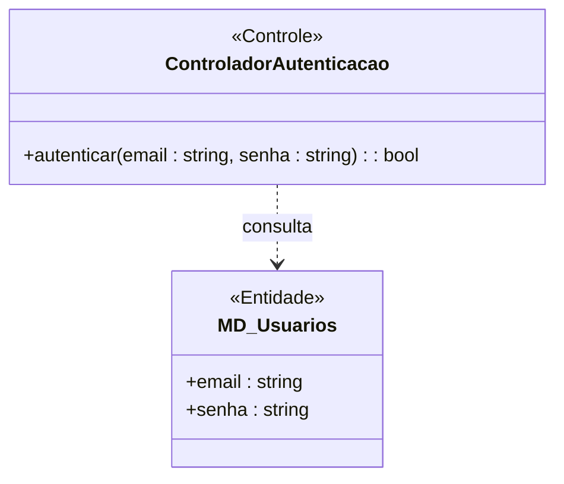
```mermaid
classDiagram
    class MD_Usuarios {
        <<Entidade>>
        +email : string
        +senha : string
    }
    class ControladorAutenticacao {
        <<Controle>>
        +autenticar(email : string, senha : string) : bool
    }
    ControladorAutenticacao ..> MD_Usuarios : consulta
```
#### Diagrama de Sequência
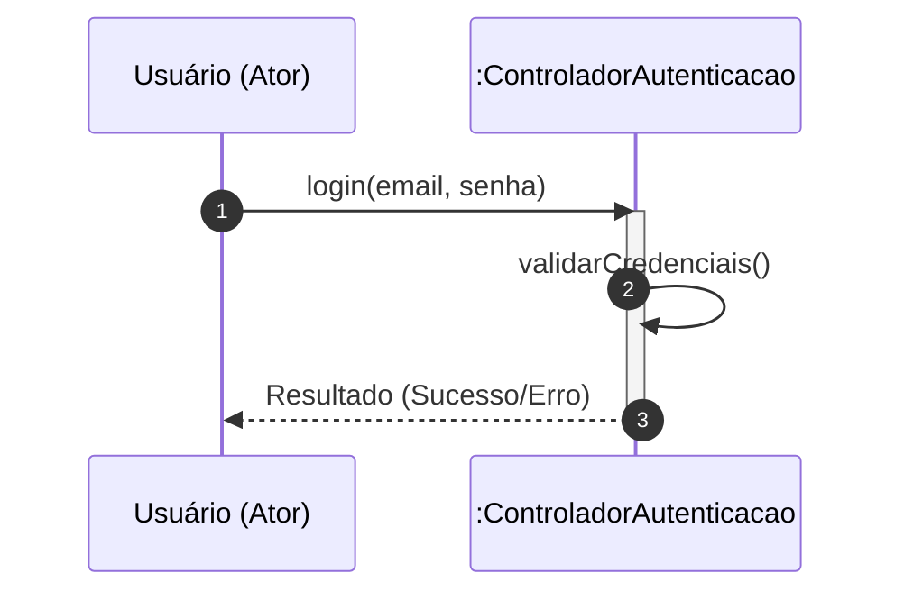
```mermaid
sequenceDiagram
    autonumber
    participant U as Usuário (Ator)
    participant C as :ControladorAutenticacao
    U->>C: login(email, senha)
    activate C
    C->>C: validarCredenciais()
    C-->>U: Resultado (Sucesso/Erro)
    deactivate C
```

[👉 Abrir Manual de Modelagem Fiel](../02_Modelagem_UML_Astah/UC01_Realizar_Login/README.md)

---

## UC02_Cadastrar_Usuario - Cadastrar Usuário
**Objetivo:** Registro de novos alunos com inicialização automática de perfil de gamificação.

### 📐 Diagramas Féis ao Astah
#### Diagrama de Classe
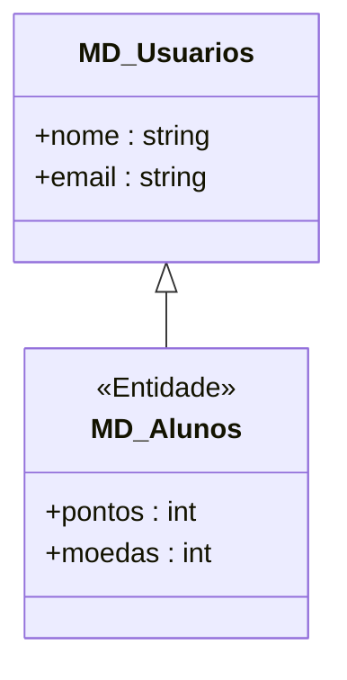
```mermaid
classDiagram
    MD_Usuarios <|-- MD_Alunos
    class MD_Usuarios {
        +nome : string
        +email : string
    }
    class MD_Alunos {
        <<Entidade>>
        +pontos : int
        +moedas : int
    }
```
#### Diagrama de Sequência
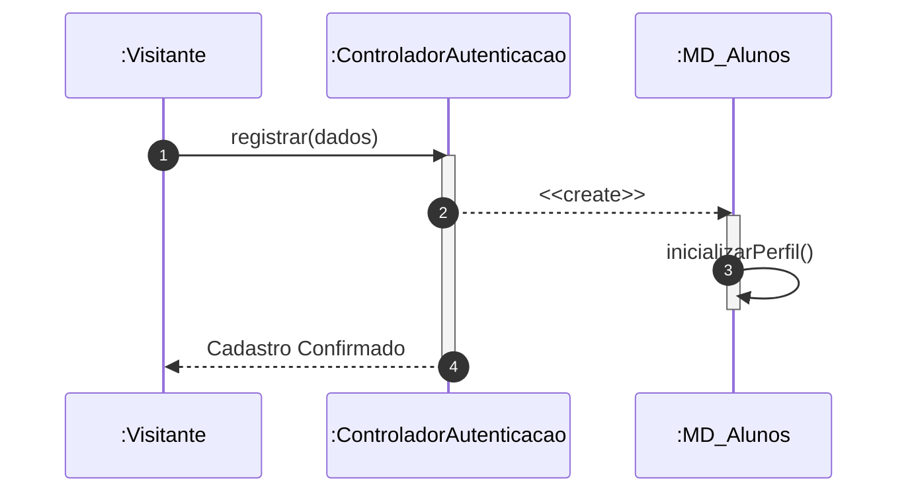
```mermaid
sequenceDiagram
    autonumber
    participant V as :Visitante
    participant C as :ControladorAutenticacao
    participant A as :MD_Alunos
    V->>C: registrar(dados)
    activate C
    C-->>A: <<create>>
    activate A
    A->>A: inicializarPerfil()
    deactivate A
    C-->>V: Cadastro Confirmado
    deactivate C
```

[👉 Abrir Manual de Modelagem Fiel](../02_Modelagem_UML_Astah/UC02_Cadastrar_Usuario/README.md)

---

## UC03_Realizar_Teste_Nivelamento - Teste de Nivelamento
**Objetivo:** Avaliação diagnóstica para posicionamento do aluno no mapa de conhecimento.

### 📐 Diagramas Féis ao Astah
#### Diagrama de Classe
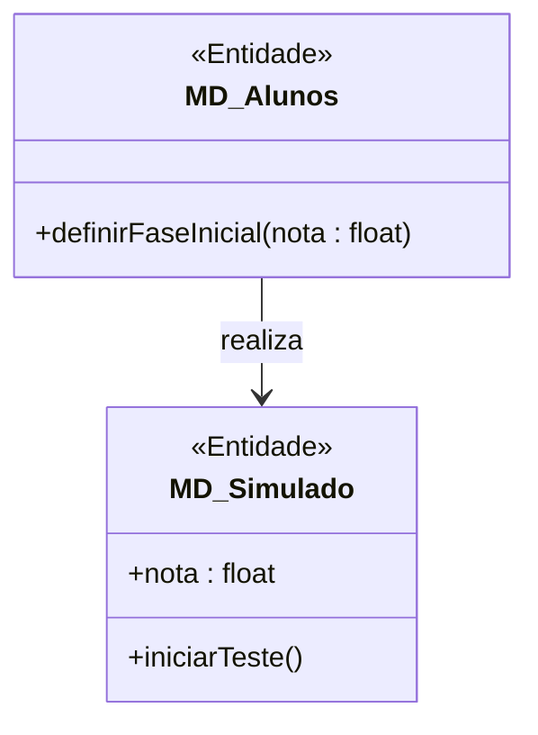
```mermaid
classDiagram
    class MD_Alunos {
        <<Entidade>>
        +definirFaseInicial(nota : float)
    }
    class MD_Simulado {
        <<Entidade>>
        +nota : float
        +iniciarTeste()
    }
    MD_Alunos --> MD_Simulado : realiza
```
#### Diagrama de Sequência
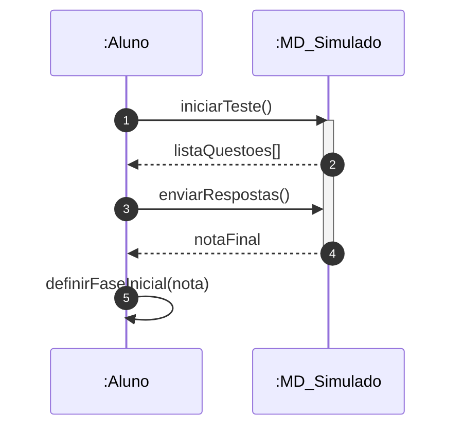
```mermaid
sequenceDiagram
    autonumber
    participant A as :Aluno
    participant S as :MD_Simulado
    A->>S: iniciarTeste()
    activate S
    S-->>A: listaQuestoes[]
    A->>S: enviarRespostas()
    S-->>A: notaFinal
    deactivate S
    A->>A: definirFaseInicial(nota)
```

[👉 Abrir Manual de Modelagem Fiel](../02_Modelagem_UML_Astah/UC03_Realizar_Teste_Nivelamento/README.md)

---

## UC04_Gerenciar_Perfis_Acessos - Gerenciar Perfis e Acessos
**Objetivo:** Administração de papéis e permissões.

### 📐 Diagramas Féis ao Astah
#### Diagrama de Classe
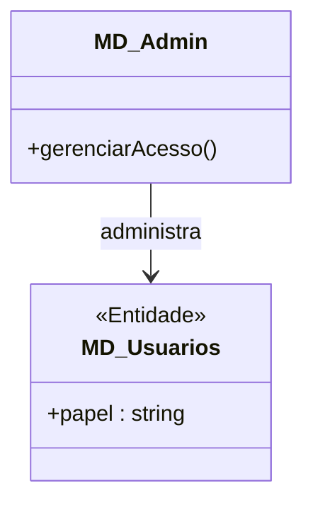
```mermaid
classDiagram
    class MD_Admin {
        +gerenciarAcesso()
    }
    class MD_Usuarios {
        <<Entidade>>
        +papel : string
    }
    MD_Admin --> MD_Usuarios : administra
```
#### Diagrama de Sequência
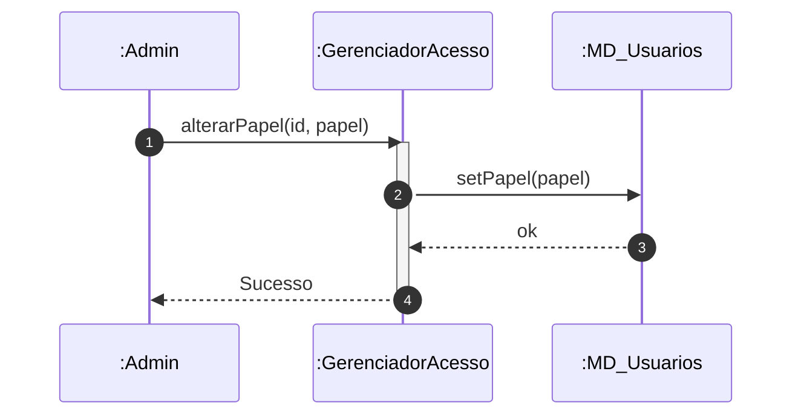
```mermaid
sequenceDiagram
    autonumber
    participant A as :Admin
    participant M as :GerenciadorAcesso
    participant U as :MD_Usuarios
    A->>M: alterarPapel(id, papel)
    activate M
    M->>U: setPapel(papel)
    U-->>M: ok
    M-->>A: Sucesso
    deactivate M
```

[👉 Abrir Manual de Modelagem Fiel](../02_Modelagem_UML_Astah/UC04_Gerenciar_Perfis_Acessos/README.md)

---

## UC05_Gerenciar_Conteudo_Cartas - Gerenciar Conteúdo e Cartas
**Objetivo:** Criação de flashcards e módulos.

### 📐 Diagramas Féis ao Astah
#### Diagrama de Classe
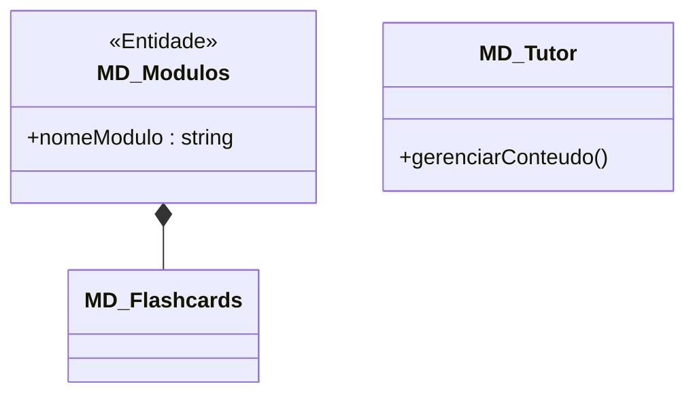
```mermaid
classDiagram
    MD_Modulos *-- MD_Flashcards
    class MD_Tutor {
        +gerenciarConteudo()
    }
    class MD_Modulos {
        <<Entidade>>
        +nomeModulo : string
    }
```
#### Diagrama de Sequência
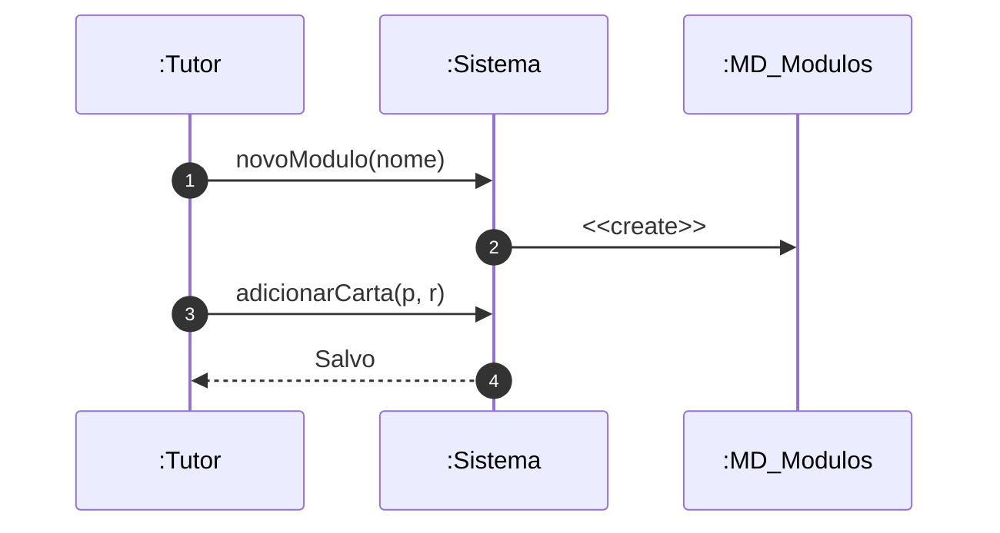
```mermaid
sequenceDiagram
    autonumber
    participant T as :Tutor
    participant S as :Sistema
    participant M as :MD_Modulos
    T->>S: novoModulo(nome)
    S->>M: <<create>>
    T->>S: adicionarCarta(p, r)
    S-->>T: Salvo
```

[👉 Abrir Manual de Modelagem Fiel](../02_Modelagem_UML_Astah/UC05_Gerenciar_Conteudo_Cartas/README.md)

---

## UC06_Acompanhar_Desempenho - Acompanhar Desempenho
**Objetivo:** Métricas de progresso.

### 📐 Diagramas Féis ao Astah
#### Diagrama de Classe
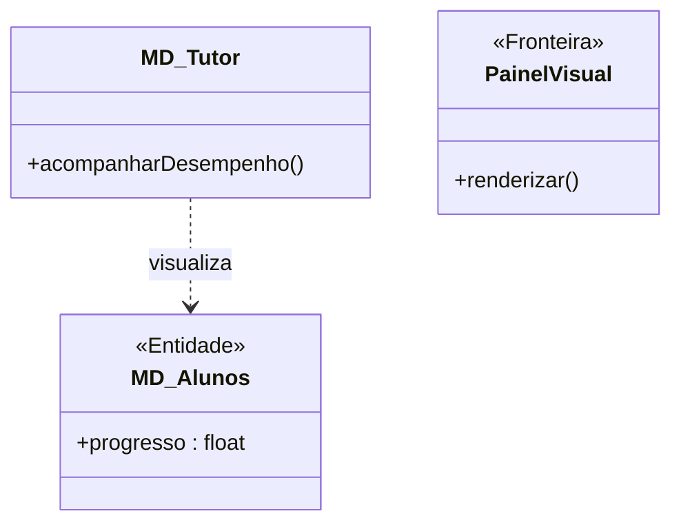
```mermaid
classDiagram
    class MD_Tutor {
        +acompanharDesempenho()
    }
    class MD_Alunos {
        <<Entidade>>
        +progresso : float
    }
    class PainelVisual {
        <<Fronteira>>
        +renderizar()
    }
    MD_Tutor ..> MD_Alunos : visualiza
```
#### Diagrama de Sequência
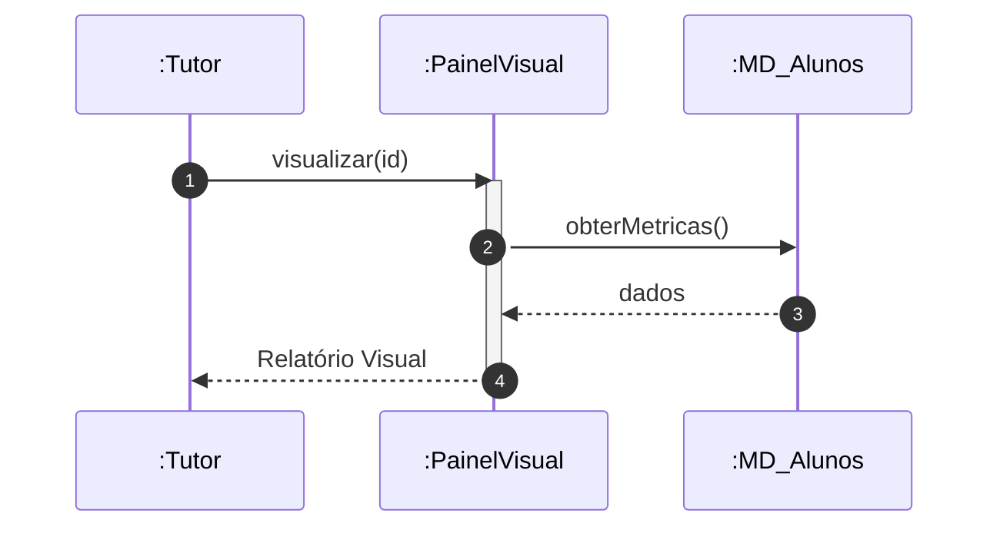
```mermaid
sequenceDiagram
    autonumber
    participant T as :Tutor
    participant D as :PainelVisual
    participant A as :MD_Alunos
    T->>D: visualizar(id)
    activate D
    D->>A: obterMetricas()
    A-->>D: dados
    D-->>T: Relatório Visual
    deactivate D
```

[👉 Abrir Manual de Modelagem Fiel](../02_Modelagem_UML_Astah/UC06_Acompanhar_Desempenho/README.md)

---

## UC07_Escalar_Duvida_Tutor - Escalar Dúvida para Tutor
**Objetivo:** Transferência IA -> Humano.

### 📐 Diagramas Féis ao Astah
#### Diagrama de Classe
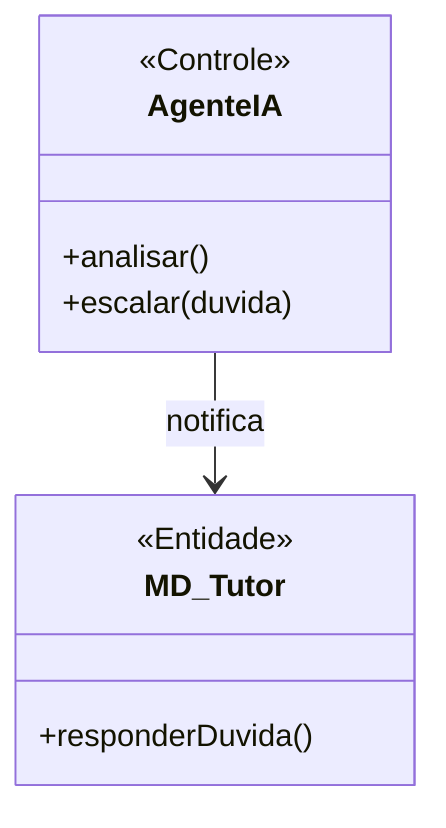
```mermaid
classDiagram
    class AgenteIA {
        <<Controle>>
        +analisar()
        +escalar(duvida)
    }
    class MD_Tutor {
        <<Entidade>>
        +responderDuvida()
    }
    AgenteIA --> MD_Tutor : notifica
```
#### Diagrama de Sequência
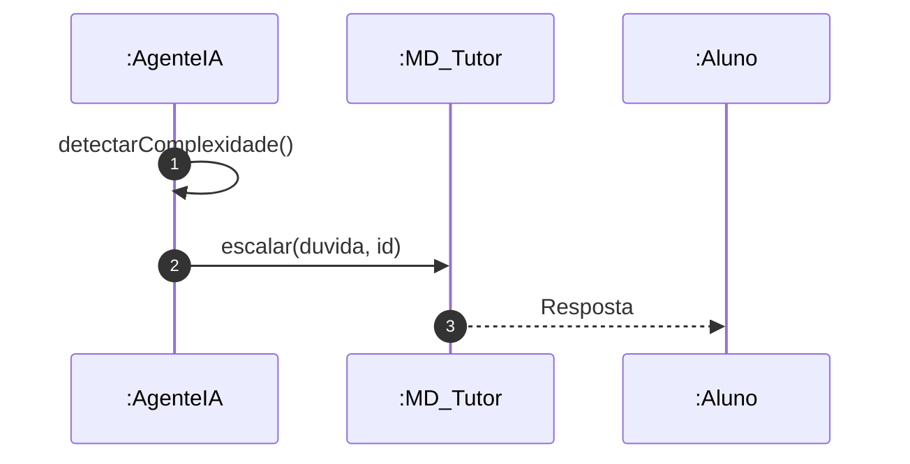
```mermaid
sequenceDiagram
    autonumber
    participant IA as :AgenteIA
    participant T as :MD_Tutor
    participant Al as :Aluno
    IA->>IA: detectarComplexidade()
    IA->>T: escalar(duvida, id)
    T-->>Al: Resposta
```

[👉 Abrir Manual de Modelagem Fiel](../02_Modelagem_UML_Astah/UC07_Escalar_Duvida_Tutor/README.md)

---

## UC08_Consultar_Agente_IA - Consultar Agente IA
**Objetivo:** Interação instantânea.

### 📐 Diagramas Féis ao Astah
#### Diagrama de Classe
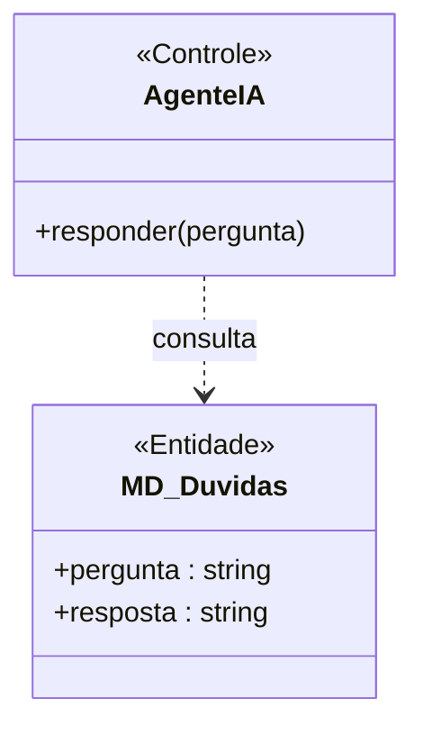
```mermaid
classDiagram
    class AgenteIA {
        <<Controle>>
        +responder(pergunta)
    }
    class MD_Duvidas {
        <<Entidade>>
        +pergunta : string
        +resposta : string
    }
    AgenteIA ..> MD_Duvidas : consulta
```
#### Diagrama de Sequência
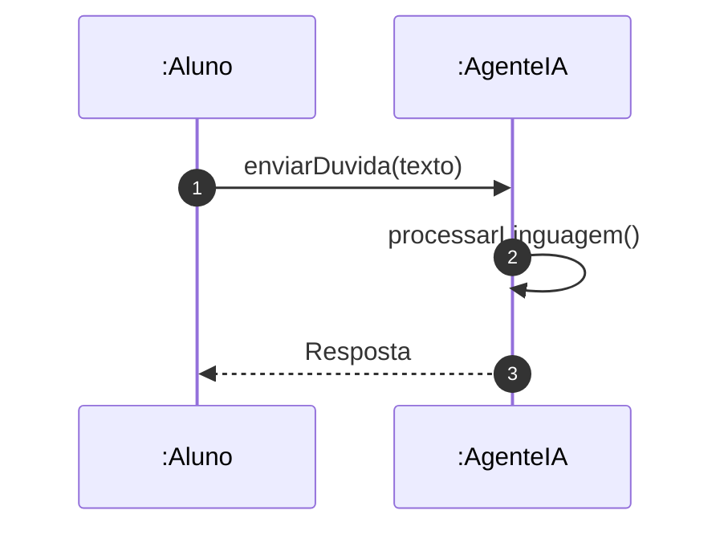
```mermaid
sequenceDiagram
    autonumber
    participant A as :Aluno
    participant IA as :AgenteIA
    A->>IA: enviarDuvida(texto)
    IA->>IA: processarLinguagem()
    IA-->>A: Resposta
```

[👉 Abrir Manual de Modelagem Fiel](../02_Modelagem_UML_Astah/UC08_Consultar_Agente_IA/README.md)

---

## UC09_Estudar_Flashcards - Estudar Flashcards (SM-2)
**Objetivo:** Repetição espaçada.

### 📐 Diagramas Féis ao Astah
#### Diagrama de Classe
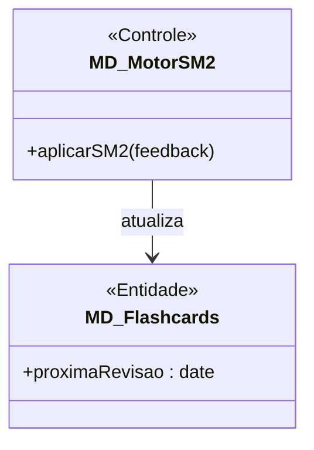
```mermaid
classDiagram
    class MD_MotorSM2 {
        <<Controle>>
        +aplicarSM2(feedback)
    }
    class MD_Flashcards {
        <<Entidade>>
        +proximaRevisao : date
    }
    MD_MotorSM2 --> MD_Flashcards : atualiza
```
#### Diagrama de Sequência
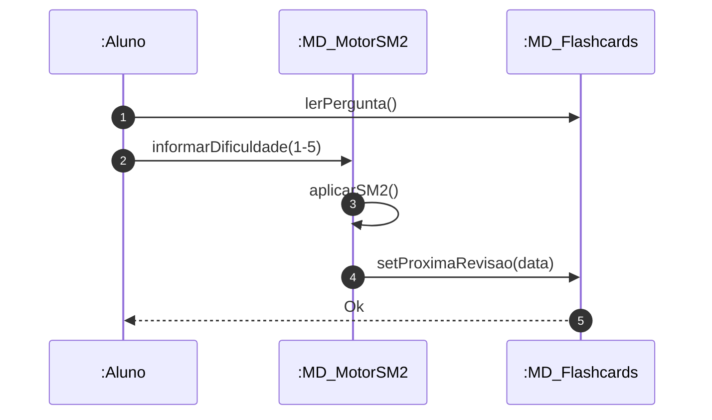
```mermaid
sequenceDiagram
    autonumber
    participant A as :Aluno
    participant M as :MD_MotorSM2
    participant F as :MD_Flashcards
    A->>F: lerPergunta()
    A->>M: informarDificuldade(1-5)
    M->>M: aplicarSM2()
    M->>F: setProximaRevisao(data)
    F-->>A: Ok
```

[👉 Abrir Manual de Modelagem Fiel](../02_Modelagem_UML_Astah/UC09_Estudar_Flashcards/README.md)

---

## UC10_Criar_Flashcards - Criar Flashcards
**Objetivo:** Personalização de deck.

### 📐 Diagramas Féis ao Astah
#### Diagrama de Classe
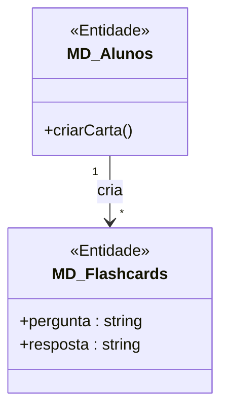
```mermaid
classDiagram
    class MD_Alunos {
        <<Entidade>>
        +criarCarta()
    }
    class MD_Flashcards {
        <<Entidade>>
        +pergunta : string
        +resposta : string
    }
    MD_Alunos "1" --> "*" MD_Flashcards : cria
```
#### Diagrama de Sequência
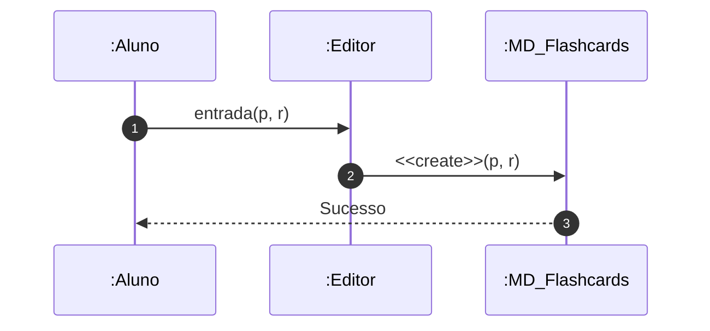
```mermaid
sequenceDiagram
    autonumber
    participant A as :Aluno
    participant E as :Editor
    participant F as :MD_Flashcards
    A->>E: entrada(p, r)
    E->>F: <<create>>(p, r)
    F-->>A: Sucesso
```

[👉 Abrir Manual de Modelagem Fiel](../02_Modelagem_UML_Astah/UC10_Criar_Flashcards/README.md)

---

## UC11_Realizar_Simulado_ENADE - Realizar Simulado ENADE
**Objetivo:** Treinamento intensivo.

### 📐 Diagramas Féis ao Astah
#### Diagrama de Classe
```mermaid
classDiagram
    class MD_Simulado {
        <<Entidade>>
        +tempoRestante : int
        +iniciarTeste()
    }
    class Questao {
        <<Entidade>>
        +texto : string
    }
    MD_Simulado "1" *-- "*" Questao
```
#### Diagrama de Sequência
```mermaid
sequenceDiagram
    autonumber
    participant A as :Aluno
    participant S as :MD_Simulado
    participant T as :Temporizador
    A->>S: iniciarTeste()
    S->>T: iniciar()
    A->>S: responder()
    S-->>A: Nota Final
```

[👉 Abrir Manual de Modelagem Fiel](../02_Modelagem_UML_Astah/UC11_Realizar_Simulado_ENADE/README.md)

---

## UC12_Atribuir_XP_Moedas - Atribuir XP e Moedas
**Objetivo:** Motor de recompensas.

### 📐 Diagramas Féis ao Astah
#### Diagrama de Classe
```mermaid
classDiagram
    class MD_Gamificacao {
        <<Controle>>
        +calcularBonus()
    }
    class MD_Alunos {
        <<Entidade>>
        +pontos : int
        +moedas : int
    }
    MD_Gamificacao ..> MD_Alunos : credita
```
#### Diagrama de Sequência
```mermaid
sequenceDiagram
    autonumber
    participant S as :Sistema
    participant G as :MD_Gamificacao
    participant A as :MD_Alunos
    S->>G: concluirTarefa()
    G->>G: calcular()
    G->>A: creditarXP(100)
    G-->>S: Ok
```

[👉 Abrir Manual de Modelagem Fiel](../02_Modelagem_UML_Astah/UC12_Atribuir_XP_Moedas/README.md)

---

## UC13_Desbloquear_Fases_Modulos - Desbloquear Fases e Módulos
**Objetivo:** Progressão condicionada.

### 📐 Diagramas Féis ao Astah
#### Diagrama de Classe
```mermaid
classDiagram
    class MD_Fases {
        <<Entidade>>
        +bloqueada : bool
        +desbloquear()
    }
    class MD_Alunos {
        <<Entidade>>
        +progresso : float
    }
    MD_Fases ..> MD_Alunos : verifica
```
#### Diagrama de Sequência
```mermaid
sequenceDiagram
    autonumber
    participant M as :GerenciadorProgresso
    participant A as :MD_Alunos
    participant F as :MD_Fases
    M->>A: obterProgresso()
    M->>F: desbloquear()
    F-->>M: Sucesso
```

[👉 Abrir Manual de Modelagem Fiel](../02_Modelagem_UML_Astah/UC13_Desbloquear_Fases_Modulos/README.md)

---

## UC14_Visualizar_Painel_Progresso - Visualizar Painel de Progresso
**Objetivo:** Hub central.

### 📐 Diagramas Féis ao Astah
#### Diagrama de Classe
```mermaid
classDiagram
    class PainelVisual {
        <<Fronteira>>
        +renderizar()
    }
    class MD_Alunos {
        <<Entidade>>
        +obterProgresso()
    }
    PainelVisual ..> MD_Alunos : lê
```
#### Diagrama de Sequência
```mermaid
sequenceDiagram
    autonumber
    participant Al as :Aluno
    participant D as :PainelVisual
    Al->>D: abrirHome()
    D->>D: renderizar()
    D-->>Al: Ok
```

[👉 Abrir Manual de Modelagem Fiel](../02_Modelagem_UML_Astah/UC14_Visualizar_Painel_Progresso/README.md)

---

## UC15_Ajustar_Acessibilidade - Ajustar Acessibilidade
**Objetivo:** Personalização.

### 📐 Diagramas Féis ao Astah
#### Diagrama de Classe
```mermaid
classDiagram
    class MD_Acessibilidade {
        <<Entidade>>
        +altoContraste : bool
        +tamanhoFonte : int
        +salvar()
    }
```
#### Diagrama de Sequência
```mermaid
sequenceDiagram
    autonumber
    participant U as :Usuario
    participant P as :PainelConfiguracao
    participant A as :MD_Acessibilidade
    U->>P: selecionarOpcao()
    P->>A: salvar()
    A-->>P: ok
```

[👉 Abrir Manual de Modelagem Fiel](../02_Modelagem_UML_Astah/UC15_Ajustar_Acessibilidade/README.md)
