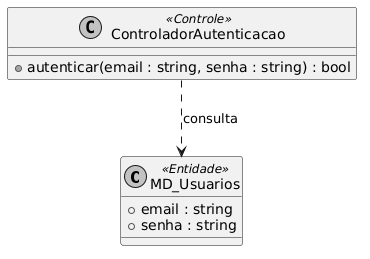
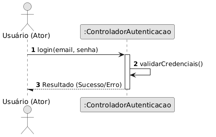
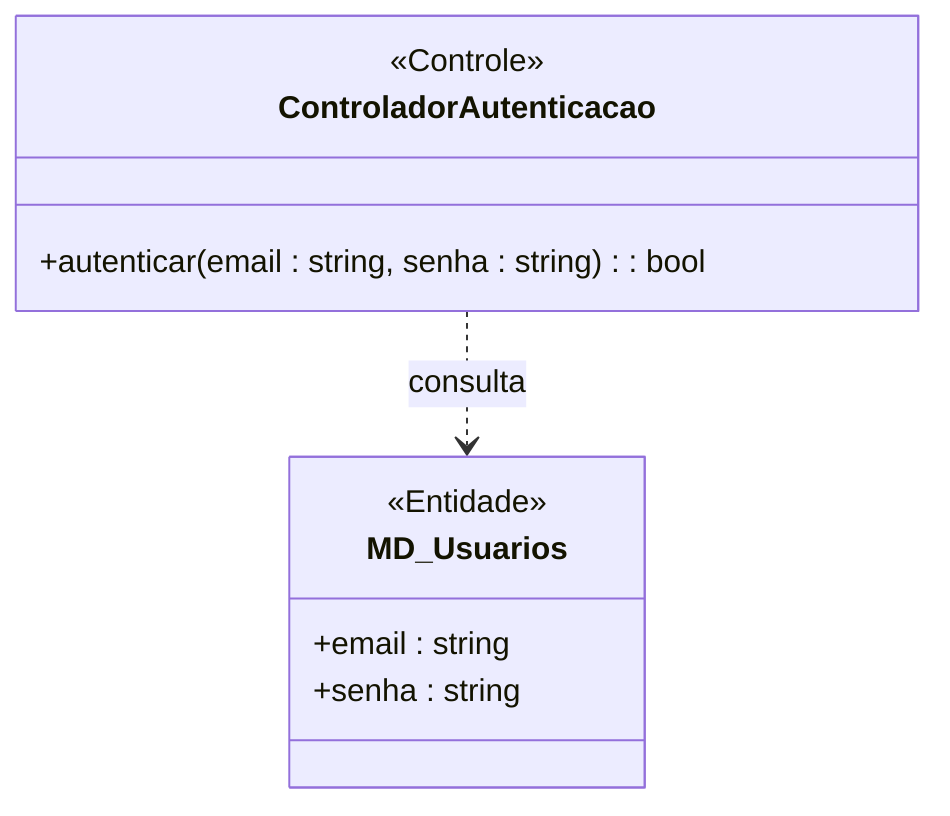
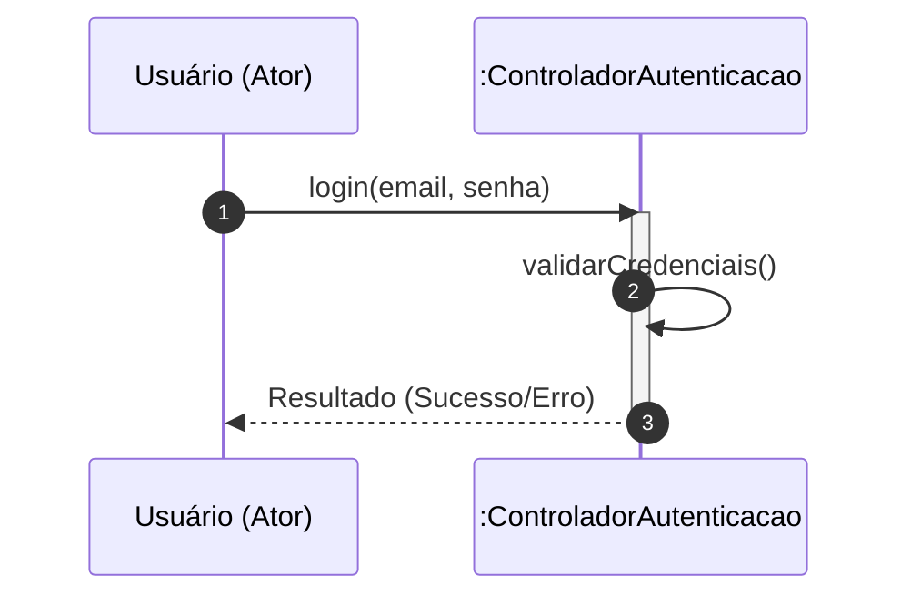

# 📘 Guia de Modelagem Astah (Fiel à v10.x): Realizar Login

## 🎯 Objetivo
Acesso seguro do usuário ao sistema através de validação de credenciais.

> [!IMPORTANT]
> Dica Astah: Utilize 'Activation Bars' para mostrar o processamento no Controlador.

## 🚀 Tutorial Passo a Passo Detalhado (Interface Astah)

### 1️⃣ Diagrama de Classe (Estrutura)
   - [ ] 1. **Crie a classe 'MD_Usuarios' e aplique o Estereótipo <<Entidade>>.**
   - [ ] 2. **Adicione os atributos: '+ email : string' e '+ senha : string'.**
   - [ ] 3. **Crie a classe 'ControladorAutenticacao' e aplique o Estereótipo <<Controle>>.**
   - [ ] 4. **Adicione o método: '+ autenticar(email : string, senha : string) : bool'.**
   - [ ] 5. **Desenhe uma seta de 'Dependência' (tracejada) saindo do Controlador para a Entidade.**

**Como configurar no Astah:** Para adicionar o Estereótipo (ex: <<Entidade>>), selecione a classe, vá na aba **Stereotype** (na base da tela) e clique em **Add**.

### 2️⃣ Diagrama de Sequência (Processo)
   - [ ] 1. **Adicione o Ator 'Usuario' e a Linha de Vida ':ControladorAutenticacao'.**
   - [ ] 2. **Mensagem 1: Usuario envia 'login(email, senha)' para o Controlador.**
   - [ ] 3. **Mensagem 1.1: O Controlador executa nele mesmo 'validarCredenciais()'.**
   - [ ] 4. **Mensagem de Retorno: Seta tracejada voltando para o Usuario com o Resultado.**

**Dica de Notação:** Note que os nomes das Linhas de Vida agora começam com dois pontos (ex: `:Controlador`), indicando que são instâncias anônimas da classe.

---

## 🛠️ Artefatos de Alta Fidelidade (PlantUML)

### Diagrama de Classe (Premium)

### Diagrama de Sequência (Premium)

---

## 📊 Referência Visual (Estilo Astah UML)
### Diagrama de Classe

### Diagrama de Sequência

---
*Este manual foi otimizado para a versão 10.1.0 do Astah UML.*