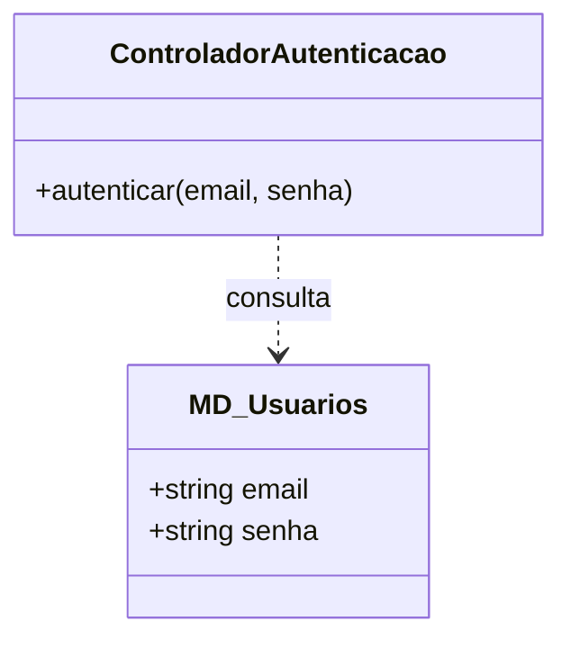
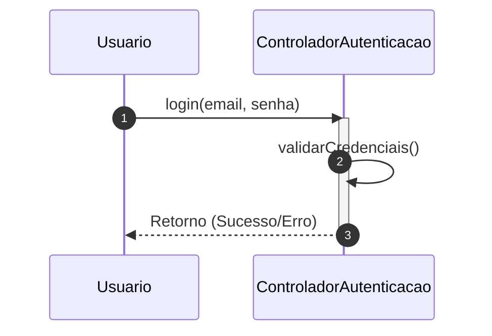

# 📘 Guia de Modelagem Detalhado: Realizar Login

## 🎯 Objetivo
Acesso seguro do usuário ao sistema através de validação de credenciais.

> [!IMPORTANT]
> Dica Astah: Utilize 'Activation Bars' para mostrar o processamento no Controlador.

## 🚀 Tutorial de Execução Passo a Passo no Astah

### 1️⃣ Construindo o Diagrama de Classe (O QUE criar)
Siga esta ordem exata para garantir a consistência:
   - [ ] 1. **Crie a classe 'MD_Usuarios' (Entidade de Dados).**
   - [ ] 2. **Adicione os atributos: '+ email: texto' e '+ senha: texto'.**
   - [ ] 3. **Crie a classe 'ControladorAutenticacao' (Lógica de Controle).**
   - [ ] 4. **Adicione o método: '+ autenticar(email, senha)'.**
   - [ ] 5. **Desenhe uma seta de 'Dependência' (tracejada) saindo do Controlador para a Entidade.**

**Como conectar?** Utilize as ferramentas de ligação na barra lateral do Astah. Se for Herança, procure pelo ícone de triângulo. Se for Dependência, use a linha tracejada.

### 2️⃣ Construindo o Diagrama de Sequência (COMO o processo flui)
Desenhe a interação temporal entre as classes:
   - [ ] 1. **Adicione o Ator 'Usuario' e o Participante 'ControladorAutenticacao'.**
   - [ ] 2. **Desenhe uma 'Mensagem Síncrona' do Usuario para o Controlador chamando 'login(email, senha)'.**
   - [ ] 3. **No Controlador, adicione uma 'Mensagem para si mesmo' (Self-Message) chamada 'validarCredenciais()'.**
   - [ ] 4. **Desenhe a 'Mensagem de Resposta' (seta tracejada) voltando para o Usuario com o resultado.**

**Dica Visual:** No Astah, as mensagens de retorno (setas tracejadas) são configuradas nas propriedades da mensagem enviada ou desenhadas separadamente.

---

## 📊 Referência Visual (Modelo Final)
### Diagrama de Classe

### Diagrama de Sequência

---
*Este guia foi projetado para ser infalível. Siga os passos acima e sua modelagem estará tecnicamente perfeita.*