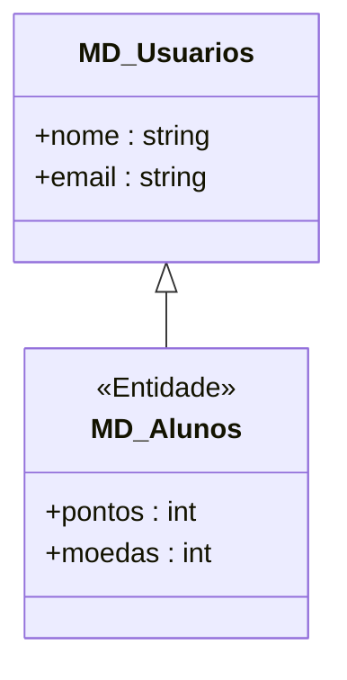
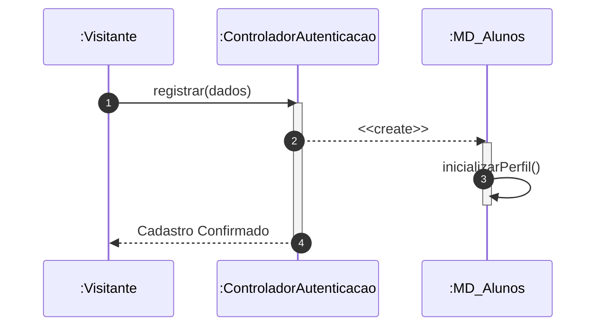

# 📘 Guia de Modelagem Astah (Fiel à v10.x): Cadastrar Usuário

## 🎯 Objetivo
Registro de novos alunos com inicialização automática de perfil de gamificação.

> [!IMPORTANT]
> Dica Astah: A seta de Herança (Generalização) é a que possui o triângulo na ponta.

## 🚀 Tutorial Passo a Passo Detalhado (Interface Astah)

### 1️⃣ Diagrama de Classe (Estrutura)
   - [ ] 1. **Crie a classe base 'MD_Usuarios' com 'nome : string' e 'email : string'.**
   - [ ] 2. **Crie a classe 'MD_Alunos' (Estereótipo <<Entidade>>).**
   - [ ] 3. **Desenhe a 'Generalização' (Herança) de MD_Alunos apontando para MD_Usuarios.**
   - [ ] 4. **Adicione em MD_Alunos os atributos: '+ pontos : int' e '+ moedas : int'.**

**Como configurar no Astah:** Para adicionar o Estereótipo (ex: <<Entidade>>), selecione a classe, vá na aba **Stereotype** (na base da tela) e clique em **Add**.

### 2️⃣ Diagrama de Sequência (Processo)
   - [ ] 1. **Linhas de Vida: :Visitante, :ControladorAutenticacao e :MD_Alunos.**
   - [ ] 2. **Mensagem 1: Visitante solicita 'registrar(dados)'.**
   - [ ] 3. **Mensagem 2: O Controlador cria o objeto 'MD_Alunos' usando a seta de 'Create Message'.**
   - [ ] 4. **Mensagem 3: O objeto recém-criado executa internamente 'inicializarPerfil()'.**

**Dica de Notação:** Note que os nomes das Linhas de Vida agora começam com dois pontos (ex: `:Controlador`), indicando que são instâncias anônimas da classe.

---

## 📊 Referência Visual (Estilo Astah UML)
### Diagrama de Classe

### Diagrama de Sequência

---
*Este manual foi otimizado para a versão 10.1.0 do Astah UML.*