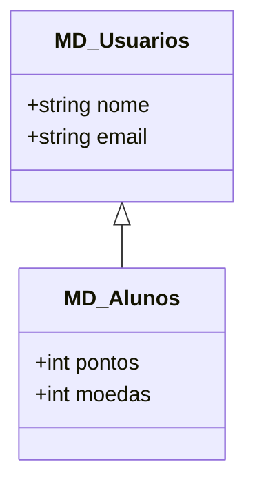
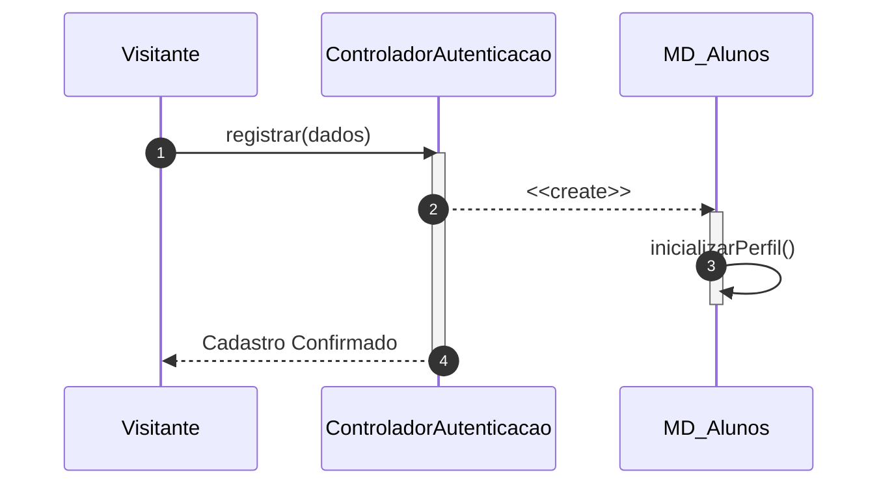

# 📘 Guia de Modelagem Detalhado: Cadastrar Usuário

## 🎯 Objetivo
Registro de novos alunos com inicialização automática de perfil de gamificação.

> [!IMPORTANT]
> Dica Astah: A seta de Herança (Generalização) é a que possui o triângulo na ponta.

## 🚀 Tutorial de Execução Passo a Passo no Astah

### 1️⃣ Construindo o Diagrama de Classe (O QUE criar)
Siga esta ordem exata para garantir a consistência:
   - [ ] 1. **Crie a classe base 'MD_Usuarios' com 'nome' e 'email'.**
   - [ ] 2. **Crie a classe 'MD_Alunos'.**
   - [ ] 3. **Desenhe a 'Generalização' (Herança) de MD_Alunos apontando para MD_Usuarios.**
   - [ ] 4. **Adicione em MD_Alunos os atributos: '+ pontos: int' e '+ moedas: int'.**

**Como conectar?** Utilize as ferramentas de ligação na barra lateral do Astah. Se for Herança, procure pelo ícone de triângulo. Se for Dependência, use a linha tracejada.

### 2️⃣ Construindo o Diagrama de Sequência (COMO o processo flui)
Desenhe a interação temporal entre as classes:
   - [ ] 1. **Coloque os participantes: Visitante, ControladorAutenticacao e MD_Alunos.**
   - [ ] 2. **Mensagem 1: Visitante solicita 'registrar(dados)' ao Controlador.**
   - [ ] 3. **Mensagem 2: O Controlador cria o objeto 'MD_Alunos' (utilize a mensagem de criação 'Create').**
   - [ ] 4. **Mensagem 3: O objeto recém-criado executa internamente 'inicializarPerfil()'.**

**Dica Visual:** No Astah, as mensagens de retorno (setas tracejadas) são configuradas nas propriedades da mensagem enviada ou desenhadas separadamente.

---

## 📊 Referência Visual (Modelo Final)
### Diagrama de Classe

### Diagrama de Sequência

---
*Este guia foi projetado para ser infalível. Siga os passos acima e sua modelagem estará tecnicamente perfeita.*