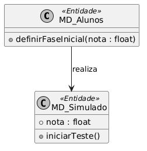
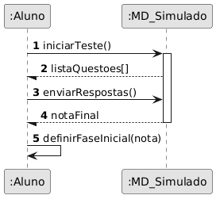
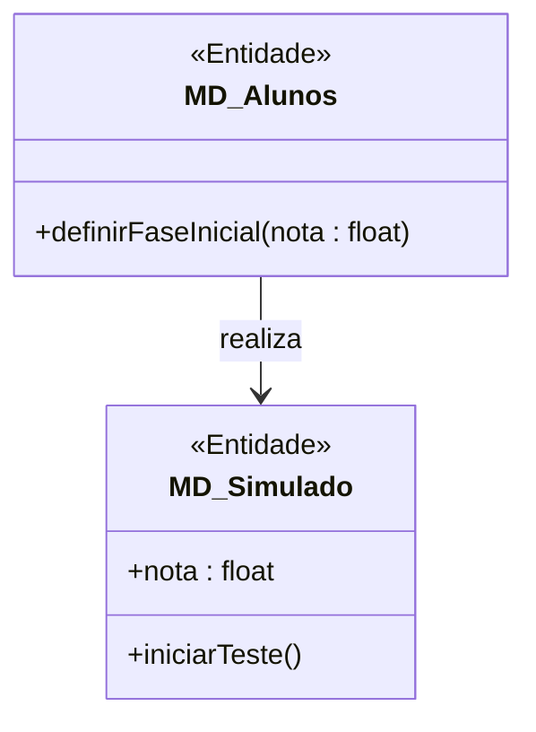
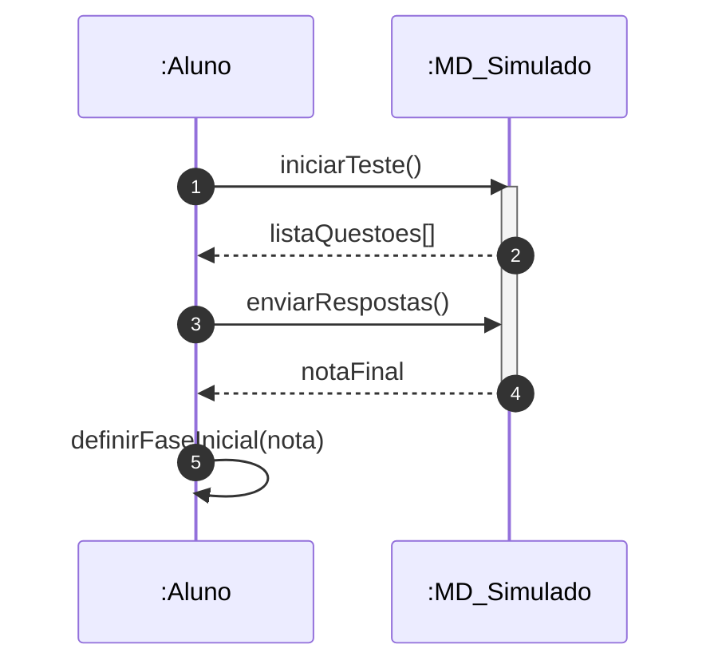

# 📘 Guia de Modelagem Astah (Fiel à v10.x): Teste de Nivelamento

## 🎯 Objetivo
Avaliação diagnóstica para posicionamento do aluno no mapa de conhecimento.

> [!IMPORTANT]
> Dica Astah: Use Agregação (losango vazio) para mostrar que o Simulado agrega questões.

## 🚀 Tutorial Passo a Passo Detalhado (Interface Astah)

### 1️⃣ Diagrama de Classe (Estrutura)
   - [ ] 1. **Crie 'MD_Alunos' com o método '+ definirFaseInicial(nota : float)'.**
   - [ ] 2. **Crie 'MD_Simulado' (<<Entidade>>) com o método '+ iniciarTeste()'.**
   - [ ] 3. **Ligue-os com uma 'Associação Unidirecional' do Aluno para o Simulado.**

**Como configurar no Astah:** Para adicionar o Estereótipo (ex: <<Entidade>>), selecione a classe, vá na aba **Stereotype** (na base da tela) e clique em **Add**.

### 2️⃣ Diagrama de Sequência (Processo)
   - [ ] 1. **Linhas de Vida: :Aluno e :MD_Simulado.**
   - [ ] 2. **Mensagem 1: Aluno chama 'iniciarTeste()' no Simulado.**
   - [ ] 3. **Mensagem de Retorno: Simulado devolve 'listaQuestoes'.**
   - [ ] 4. **Mensagem 2: Aluno envia 'enviarRespostas()'.**
   - [ ] 5. **Mensagem 3: Aluno executa nele mesmo 'definirFaseInicial(nota)'.**

**Dica de Notação:** Note que os nomes das Linhas de Vida agora começam com dois pontos (ex: `:Controlador`), indicando que são instâncias anônimas da classe.

---

## 🛠️ Artefatos de Alta Fidelidade (PlantUML)

### Diagrama de Classe (Premium)

### Diagrama de Sequência (Premium)

---

## 📊 Referência Visual (Estilo Astah UML)
### Diagrama de Classe

### Diagrama de Sequência

---
*Este manual foi otimizado para a versão 10.1.0 do Astah UML.*