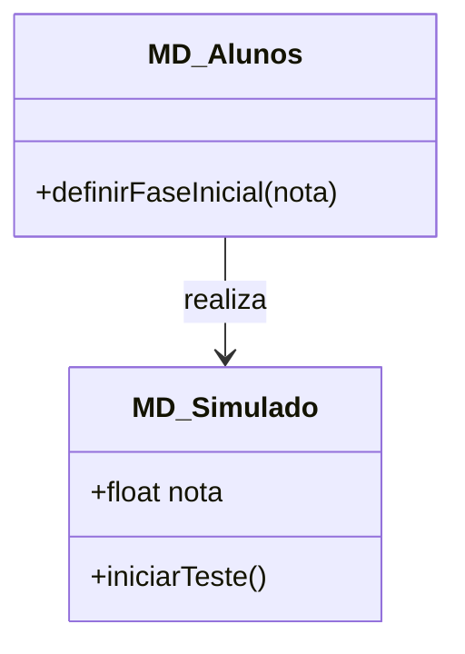
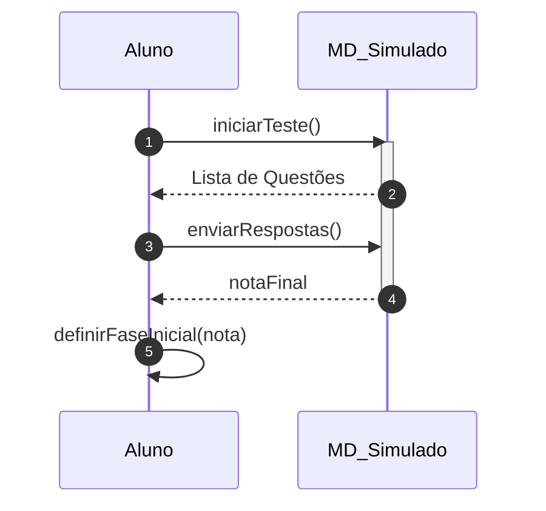

# 📘 Guia de Modelagem Detalhado: Teste de Nivelamento

## 🎯 Objetivo
Avaliação diagnóstica para posicionamento do aluno no mapa de conhecimento.

> [!IMPORTANT]
> Dica Astah: Use Agregação (losango vazio) para mostrar que o Simulado agrega questões.

## 🚀 Tutorial de Execução Passo a Passo no Astah

### 1️⃣ Construindo o Diagrama de Classe (O QUE criar)
Siga esta ordem exata para garantir a consistência:
   - [ ] 1. **Crie 'MD_Alunos' com o método '+ definirFaseInicial(nota)'.**
   - [ ] 2. **Crie 'MD_Simulado' com o método '+ iniciarTeste()'.**
   - [ ] 3. **Desenhe uma 'Associação Unidirecional' (seta simples) do Aluno para o Simulado.**

**Como conectar?** Utilize as ferramentas de ligação na barra lateral do Astah. Se for Herança, procure pelo ícone de triângulo. Se for Dependência, use a linha tracejada.

### 2️⃣ Construindo o Diagrama de Sequência (COMO o processo flui)
Desenhe a interação temporal entre as classes:
   - [ ] 1. **O Aluno chama 'iniciarTeste()' no objeto MD_Simulado.**
   - [ ] 2. **O Simulado retorna uma lista de questões para o Aluno.**
   - [ ] 3. **Após responder, o Aluno chama 'enviarRespostas()' no Simulado.**
   - [ ] 4. **O Aluno executa em si mesmo 'definirFaseInicial(nota)' após receber o resultado.**

**Dica Visual:** No Astah, as mensagens de retorno (setas tracejadas) são configuradas nas propriedades da mensagem enviada ou desenhadas separadamente.

---

## 📊 Referência Visual (Modelo Final)
### Diagrama de Classe

### Diagrama de Sequência

---
*Este guia foi projetado para ser infalível. Siga os passos acima e sua modelagem estará tecnicamente perfeita.*