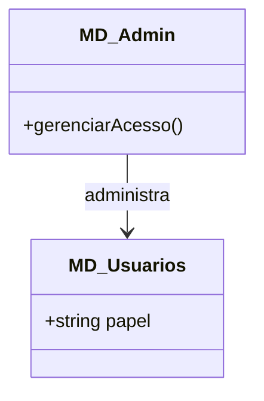
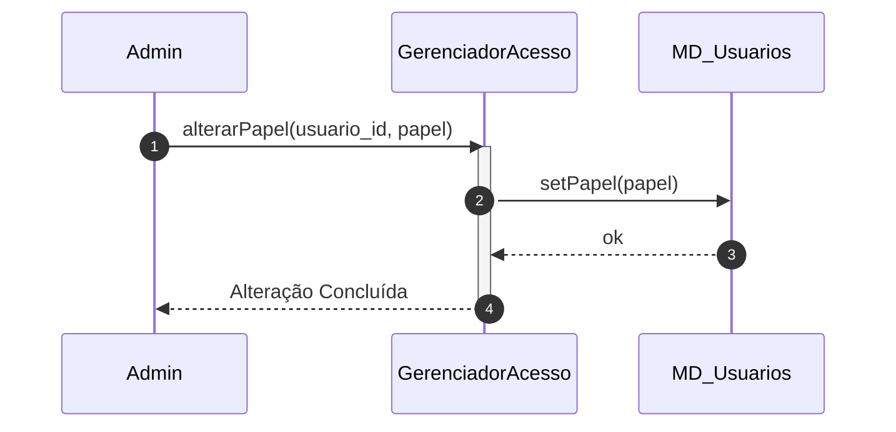

# 📘 Guia de Modelagem Detalhado: Gerenciar Perfis e Acessos

## 🎯 Objetivo
Administração de papéis (Admin, Tutor, Aluno) e permissões de sistema.

> [!IMPORTANT]
> Dica Astah: Utilize 'Notes' (Notas) para explicar o que cada papel (role) pode fazer.

## 🚀 Tutorial de Execução Passo a Passo no Astah

### 1️⃣ Construindo o Diagrama de Classe (O QUE criar)
Siga esta ordem exata para garantir a consistência:
   - [ ] 1. **Crie 'MD_Admin' e 'MD_Usuarios'.**
   - [ ] 2. **Em 'MD_Usuarios', adicione o atributo '+ papel: texto'.**
   - [ ] 3. **Crie 'GerenciadorAcesso' para mediar a troca de papéis.**
   - [ ] 4. **Desenhe uma seta de 'Associação' de Admin para Usuarios.**

**Como conectar?** Utilize as ferramentas de ligação na barra lateral do Astah. Se for Herança, procure pelo ícone de triângulo. Se for Dependência, use a linha tracejada.

### 2️⃣ Construindo o Diagrama de Sequência (COMO o processo flui)
Desenhe a interação temporal entre as classes:
   - [ ] 1. **O Admin solicita 'alterarPapel()' ao GerenciadorAcesso.**
   - [ ] 2. **O GerenciadorAcesso valida a permissão e chama 'setPapel()' no MD_Usuarios alvo.**
   - [ ] 3. **O MD_Usuarios confirma a atualização e o Gerenciador retorna o sucesso ao Admin.**

**Dica Visual:** No Astah, as mensagens de retorno (setas tracejadas) são configuradas nas propriedades da mensagem enviada ou desenhadas separadamente.

---

## 📊 Referência Visual (Modelo Final)
### Diagrama de Classe

### Diagrama de Sequência

---
*Este guia foi projetado para ser infalível. Siga os passos acima e sua modelagem estará tecnicamente perfeita.*