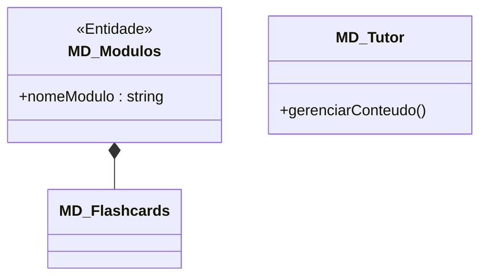
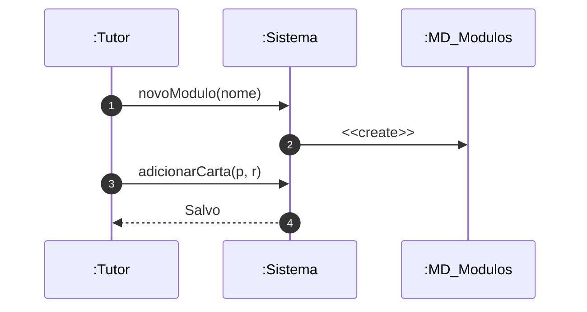

# 📘 Guia de Modelagem Astah (Fiel à v10.x): Gerenciar Conteúdo e Cartas

## 🎯 Objetivo
Criação de flashcards e módulos.

> [!IMPORTANT]
> Dica Astah: A Composição no Astah é o ícone do losango preto.

## 🚀 Tutorial Passo a Passo Detalhado (Interface Astah)

### 1️⃣ Diagrama de Classe (Estrutura)
   - [ ] 1. **Crie 'MD_Modulos' e 'MD_Flashcards'.**
   - [ ] 2. **Ligue com 'Composição' (losango no Módulo).**
   - [ ] 3. **Atributo em Módulo: '+ nomeModulo : string'.**

**Como configurar no Astah:** Para adicionar o Estereótipo (ex: <<Entidade>>), selecione a classe, vá na aba **Stereotype** (na base da tela) e clique em **Add**.

### 2️⃣ Diagrama de Sequência (Processo)
   - [ ] 1. **O Tutor solicita 'novoModulo()' ao Sistema.**
   - [ ] 2. **O Sistema cria (Create) o objeto 'MD_Modulos'.**
   - [ ] 3. **O Tutor adiciona cartas via 'adicionarCarta()'.**

**Dica de Notação:** Note que os nomes das Linhas de Vida agora começam com dois pontos (ex: `:Controlador`), indicando que são instâncias anônimas da classe.

---

## 📊 Referência Visual (Estilo Astah UML)
### Diagrama de Classe

### Diagrama de Sequência

---
*Este manual foi otimizado para a versão 10.1.0 do Astah UML.*