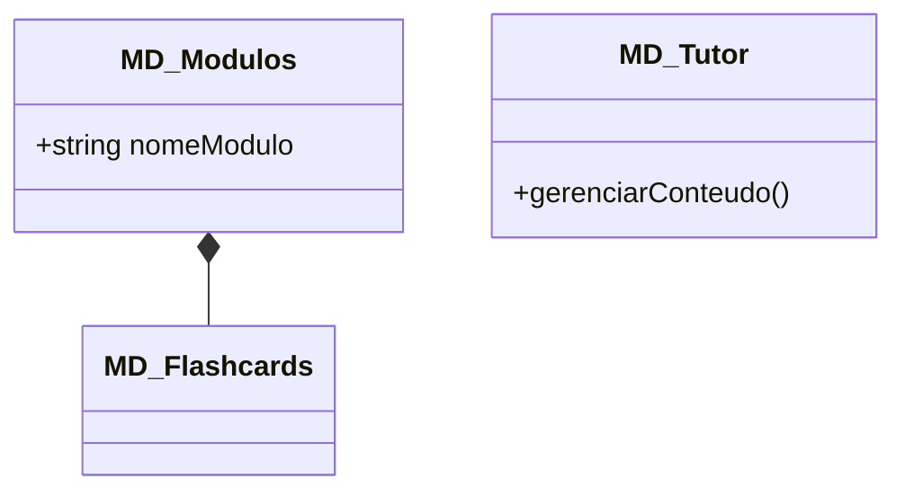
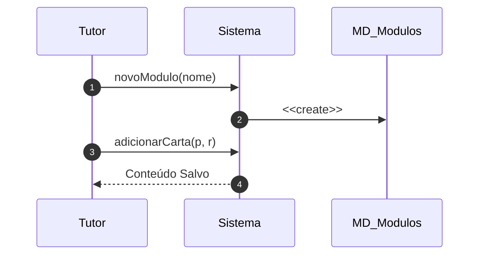

# 📘 Guia de Modelagem Detalhado: Gerenciar Conteúdo e Cartas

## 🎯 Objetivo
Criação e manutenção de flashcards e módulos de estudo pelos tutores.

> [!IMPORTANT]
> Dica Astah: A Composição é representada por um losango preenchido no lado do Módulo.

## 🚀 Tutorial de Execução Passo a Passo no Astah

### 1️⃣ Construindo o Diagrama de Classe (O QUE criar)
Siga esta ordem exata para garantir a consistência:
   - [ ] 1. **Crie 'MD_Modulos' e 'MD_Flashcards'.**
   - [ ] 2. **Desenhe uma 'Composição' de MD_Modulos para MD_Flashcards (losango preto no Módulo).**
   - [ ] 3. **Adicione em MD_Modulos o atributo '+ nomeModulo: texto'.**

**Como conectar?** Utilize as ferramentas de ligação na barra lateral do Astah. Se for Herança, procure pelo ícone de triângulo. Se for Dependência, use a linha tracejada.

### 2️⃣ Construindo o Diagrama de Sequência (COMO o processo flui)
Desenhe a interação temporal entre as classes:
   - [ ] 1. **O Tutor solicita a criação de um 'novoModulo(nome)' ao Sistema.**
   - [ ] 2. **O Sistema instancia (Create) um novo objeto 'MD_Modulos'.**
   - [ ] 3. **O Tutor adiciona cartas chamando 'adicionarCarta(p, r)' no sistema, que vincula ao módulo criado.**

**Dica Visual:** No Astah, as mensagens de retorno (setas tracejadas) são configuradas nas propriedades da mensagem enviada ou desenhadas separadamente.

---

## 📊 Referência Visual (Modelo Final)
### Diagrama de Classe

### Diagrama de Sequência

---
*Este guia foi projetado para ser infalível. Siga os passos acima e sua modelagem estará tecnicamente perfeita.*