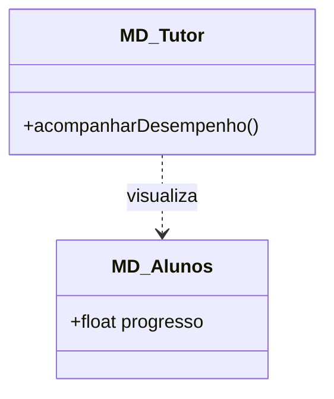
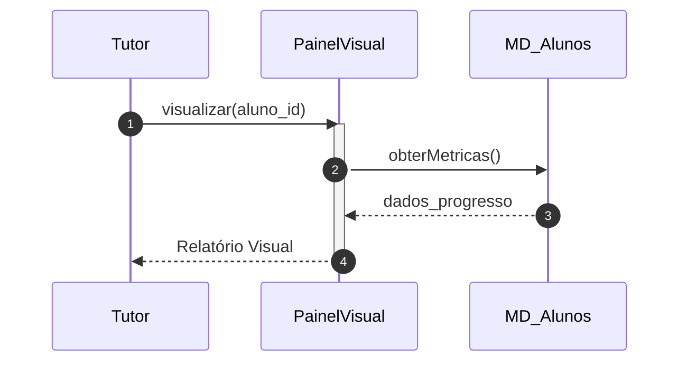

# 📘 Guia de Modelagem Detalhado: Acompanhar Desempenho

## 🎯 Objetivo
Visualização de métricas de progresso e engajamento dos alunos.

> [!IMPORTANT]
> Dica Astah: O PainelVisual é uma classe de 'Fronteira' (Interface de Usuário).

## 🚀 Tutorial de Execução Passo a Passo no Astah

### 1️⃣ Construindo o Diagrama de Classe (O QUE criar)
Siga esta ordem exata para garantir a consistência:
   - [ ] 1. **Crie as classes 'MD_Tutor', 'MD_Alunos' e 'PainelVisual'.**
   - [ ] 2. **Em 'MD_Alunos', defina '+ progresso: decimal'.**
   - [ ] 3. **Desenhe uma 'Dependência' do Tutor para o Aluno através do PainelVisual.**

**Como conectar?** Utilize as ferramentas de ligação na barra lateral do Astah. Se for Herança, procure pelo ícone de triângulo. Se for Dependência, use a linha tracejada.

### 2️⃣ Construindo o Diagrama de Sequência (COMO o processo flui)
Desenhe a interação temporal entre as classes:
   - [ ] 1. **Tutor interage com 'PainelVisual' solicitando 'visualizar(aluno_id)'.**
   - [ ] 2. **O PainelVisual busca dados reais no objeto 'MD_Alunos' chamando 'obterMetricas()'.**
   - [ ] 3. **O Aluno devolve os dados e o Painel renderiza o relatório final para o Tutor.**

**Dica Visual:** No Astah, as mensagens de retorno (setas tracejadas) são configuradas nas propriedades da mensagem enviada ou desenhadas separadamente.

---

## 📊 Referência Visual (Modelo Final)
### Diagrama de Classe

### Diagrama de Sequência

---
*Este guia foi projetado para ser infalível. Siga os passos acima e sua modelagem estará tecnicamente perfeita.*