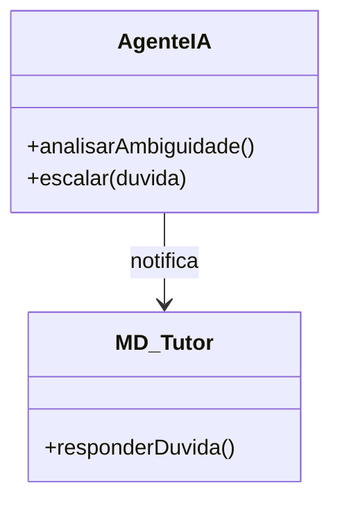
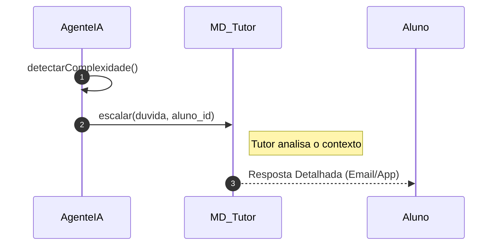

# 📘 Guia de Modelagem Detalhado: Escalar Dúvida para Tutor

## 🎯 Objetivo
Transferência de suporte da IA para um tutor humano quando a complexidade excede o limite do agente.

> [!IMPORTANT]
> Dica Astah: Represente a escala de dúvida como uma seta de 'Associação' simples entre os dois agentes.

## 🚀 Tutorial de Execução Passo a Passo no Astah

### 1️⃣ Construindo o Diagrama de Classe (O QUE criar)
Siga esta ordem exata para garantir a consistência:
   - [ ] 1. **Crie a classe 'AgenteIA' com os métodos '+ analisarAmbiguidade()' e '+ escalar(duvida)'.**
   - [ ] 2. **Crie 'MD_Tutor' com '+ responderDuvida()'.**
   - [ ] 3. **Ligue 'AgenteIA' a 'MD_Tutor' com uma seta de 'Associação'.**

**Como conectar?** Utilize as ferramentas de ligação na barra lateral do Astah. Se for Herança, procure pelo ícone de triângulo. Se for Dependência, use a linha tracejada.

### 2️⃣ Construindo o Diagrama de Sequência (COMO o processo flui)
Desenhe a interação temporal entre as classes:
   - [ ] 1. **O AgenteIA detecta internamente que a pergunta é complexa demais ('detectarComplexidade').**
   - [ ] 2. **O AgenteIA dispara uma mensagem para o MD_Tutor: 'escalar(duvida, aluno_id)'.**
   - [ ] 3. **O Tutor processa a dúvida e envia a resposta final diretamente ao Aluno.**

**Dica Visual:** No Astah, as mensagens de retorno (setas tracejadas) são configuradas nas propriedades da mensagem enviada ou desenhadas separadamente.

---

## 📊 Referência Visual (Modelo Final)
### Diagrama de Classe

### Diagrama de Sequência

---
*Este guia foi projetado para ser infalível. Siga os passos acima e sua modelagem estará tecnicamente perfeita.*