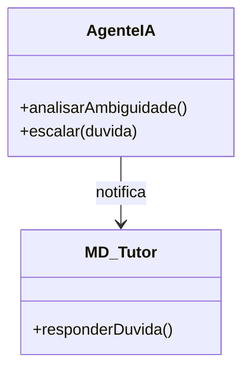
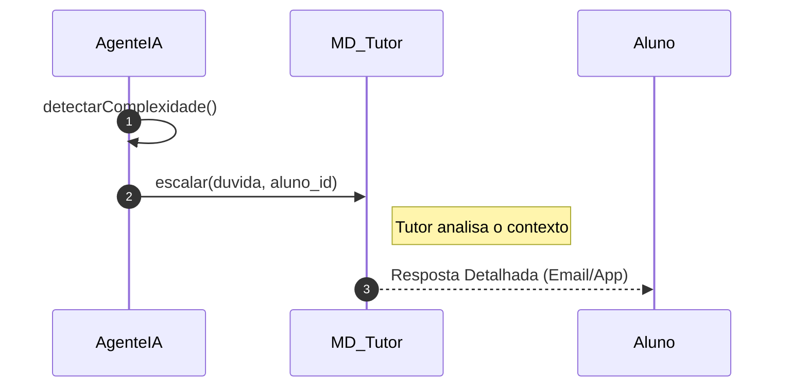

# 📘 Guia de Modelagem: Escalar Dúvida para Tutor

## 🎯 Objetivo do Caso de Uso
Transferência de suporte da IA para um tutor humano quando a complexidade excede o limite do agente.

> [!TIP]
> Dica Astah: Use uma 'Mensagem Assíncrona' para indicar que o Tutor não responderá instantaneamente.

## 🚀 Tutorial de Criação Passo a Passo (Astah)

### 1️⃣ Criando o Diagrama de Classe
1. No Menu Superior, vá em **Projeto** > **Árvore de Estrutura**.
2. Clique com o botão direito e selecione **Adicionar Diagrama** > **Diagrama de Classe**.
3. Arraste as classes para a área de desenho:
   - [ ] Criar **AgenteIA**.
   - [ ] Criar **MD_Tutor**.
   - [ ] Criar **MD_Duvidas**.
   - [ ] Criar **Associação: IA sinaliza Tutor**.
4. Adicione os **Atributos** e **Métodos** clicando com o botão direito na classe.
5. Use as ferramentas de **Associação, Dependência ou Herança** para ligar as classes conforme a referência abaixo.

### 2️⃣ Criando o Diagrama de Sequência
1. Clique com o botão direito no Caso de Uso (na Árvore) e selecione **Adicionar Diagrama** > **Diagrama de Sequência**.
2. Adicione os **Participantes** (Linhas de Vida) no topo da tela.
3. Desenhe as setas de mensagem seguindo rigorosamente esta ordem:
   - [ ] 1. **AgenteIA -> AgenteIA: analisarAmbiguidade()**
   - [ ] 2. **AgenteIA -> MD_Tutor: escalar(duvida)**
   - [ ] 3. **Tutor -->> Aluno: Resposta (Offline)**
4. Lembre-se de adicionar as **Barras de Ativação** clicando sobre a linha de vida onde houver processamento.

---

## 📊 Referência Visual (Padrão PT-BR)
### Diagrama de Classe

### Diagrama de Sequência

---
*Manual técnico gerado em Português para conformidade com o PIM III.*