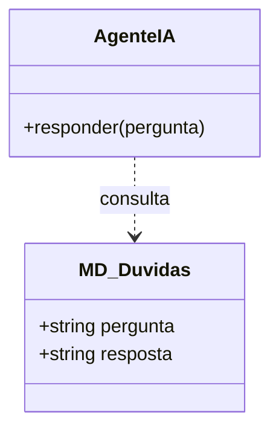
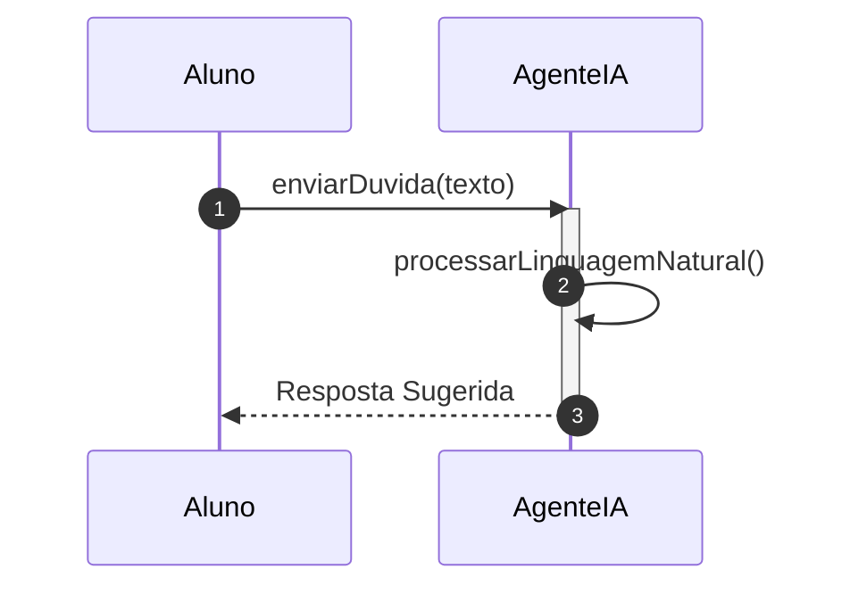

# 📘 Guia de Modelagem Detalhado: Consultar Agente IA

## 🎯 Objetivo
Interação instantânea com o especialista virtual para dúvidas pontuais.

> [!IMPORTANT]
> Dica Astah: A dependência aqui indica que a IA 'conhece' a estrutura das dúvidas salvas.

## 🚀 Tutorial de Execução Passo a Passo no Astah

### 1️⃣ Construindo o Diagrama de Classe (O QUE criar)
Siga esta ordem exata para garantir a consistência:
   - [ ] 1. **Crie 'AgenteIA' com '+ responder(pergunta)'.**
   - [ ] 2. **Crie 'MD_Duvidas' com os atributos '+ pergunta: texto' e '+ resposta: texto'.**
   - [ ] 3. **Desenhe uma 'Dependência' da IA para a classe MD_Duvidas.**

**Como conectar?** Utilize as ferramentas de ligação na barra lateral do Astah. Se for Herança, procure pelo ícone de triângulo. Se for Dependência, use a linha tracejada.

### 2️⃣ Construindo o Diagrama de Sequência (COMO o processo flui)
Desenhe a interação temporal entre as classes:
   - [ ] 1. **O Aluno envia sua dúvida para o AgenteIA.**
   - [ ] 2. **O AgenteIA ativa seu processamento de linguagem natural ('processarLinguagemNatural').**
   - [ ] 3. **O AgenteIA gera uma resposta e a entrega instantaneamente ao Aluno.**

**Dica Visual:** No Astah, as mensagens de retorno (setas tracejadas) são configuradas nas propriedades da mensagem enviada ou desenhadas separadamente.

---

## 📊 Referência Visual (Modelo Final)
### Diagrama de Classe

### Diagrama de Sequência

---
*Este guia foi projetado para ser infalível. Siga os passos acima e sua modelagem estará tecnicamente perfeita.*