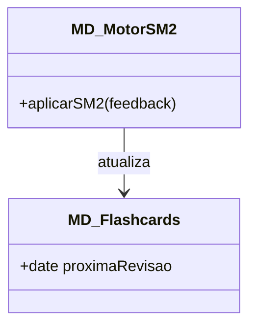
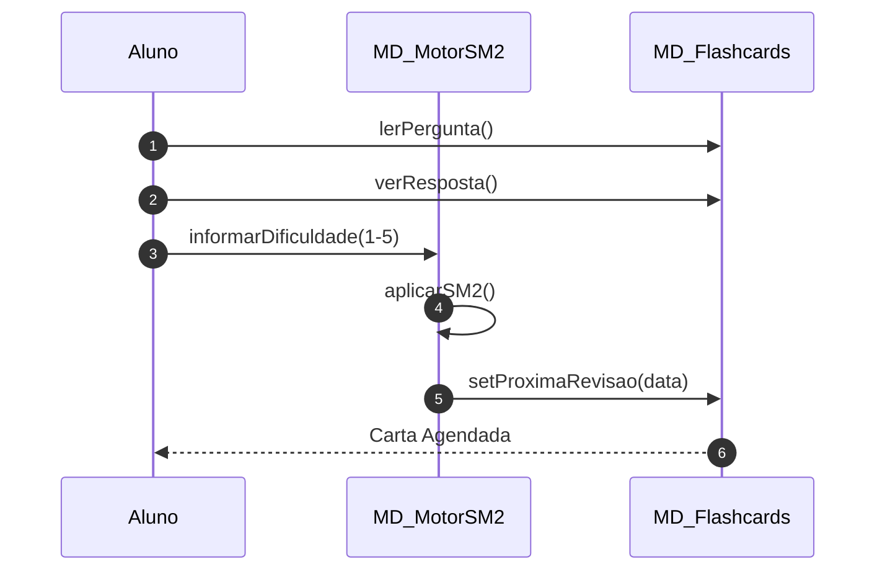

# 📘 Guia de Modelagem Detalhado: Estudar Flashcards (SM-2)

## 🎯 Objetivo
Ciclo de estudo principal utilizando o algoritmo de repetição espaçada.

> [!IMPORTANT]
> Dica Astah: No Astah, use o símbolo de 'Loop' (Combined Fragment) para cercar a revisão de cartas.

## 🚀 Tutorial de Execução Passo a Passo no Astah

### 1️⃣ Construindo o Diagrama de Classe (O QUE criar)
Siga esta ordem exata para garantir a consistência:
   - [ ] 1. **Crie 'MD_MotorSM2' e 'MD_Flashcards'.**
   - [ ] 2. **Em 'MD_MotorSM2', adicione o método '+ aplicarSM2(feedback)'.**
   - [ ] 3. **Desenhe uma seta de 'Associação' do Motor para o Flashcard.**

**Como conectar?** Utilize as ferramentas de ligação na barra lateral do Astah. Se for Herança, procure pelo ícone de triângulo. Se for Dependência, use a linha tracejada.

### 2️⃣ Construindo o Diagrama de Sequência (COMO o processo flui)
Desenhe a interação temporal entre as classes:
   - [ ] 1. **O Aluno lê uma pergunta no MD_Flashcards.**
   - [ ] 2. **O Aluno informa a dificuldade (feedback de 1 a 5) ao MD_MotorSM2.**
   - [ ] 3. **O Motor processa o algoritmo ('aplicarSM2') e chama 'setProximaRevisao(data)' no Flashcard.**
   - [ ] 4. **O Flashcard é agendado para o futuro e o processo termina.**

**Dica Visual:** No Astah, as mensagens de retorno (setas tracejadas) são configuradas nas propriedades da mensagem enviada ou desenhadas separadamente.

---

## 📊 Referência Visual (Modelo Final)
### Diagrama de Classe

### Diagrama de Sequência

---
*Este guia foi projetado para ser infalível. Siga os passos acima e sua modelagem estará tecnicamente perfeita.*