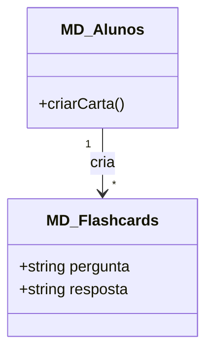
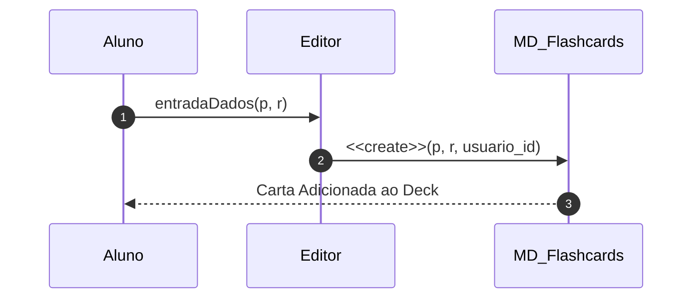

# 📘 Guia de Modelagem Detalhado: Criar Flashcards

## 🎯 Objetivo
Funcionalidade que permite ao aluno personalizar seu próprio deck de estudos.

> [!IMPORTANT]
> Dica Astah: Use a multiplicidade '1' no Aluno e '*' no Flashcard para indicar posse.

## 🚀 Tutorial de Execução Passo a Passo no Astah

### 1️⃣ Construindo o Diagrama de Classe (O QUE criar)
Siga esta ordem exata para garantir a consistência:
   - [ ] 1. **Crie 'MD_Alunos' e 'MD_Flashcards'.**
   - [ ] 2. **Adicione em MD_Alunos o método '+ criarCarta()'.**
   - [ ] 3. **Desenhe uma 'Associação' de MD_Alunos para MD_Flashcards.**

**Como conectar?** Utilize as ferramentas de ligação na barra lateral do Astah. Se for Herança, procure pelo ícone de triângulo. Se for Dependência, use a linha tracejada.

### 2️⃣ Construindo o Diagrama de Sequência (COMO o processo flui)
Desenhe a interação temporal entre as classes:
   - [ ] 1. **O Aluno utiliza um 'Editor' (Interface) para digitar pergunta e resposta.**
   - [ ] 2. **O Editor envia os dados para 'MD_Flashcards' via comando '<<create>>'.**
   - [ ] 3. **A nova carta é salva vinculada ao ID do Aluno.**

**Dica Visual:** No Astah, as mensagens de retorno (setas tracejadas) são configuradas nas propriedades da mensagem enviada ou desenhadas separadamente.

---

## 📊 Referência Visual (Modelo Final)
### Diagrama de Classe

### Diagrama de Sequência

---
*Este guia foi projetado para ser infalível. Siga os passos acima e sua modelagem estará tecnicamente perfeita.*