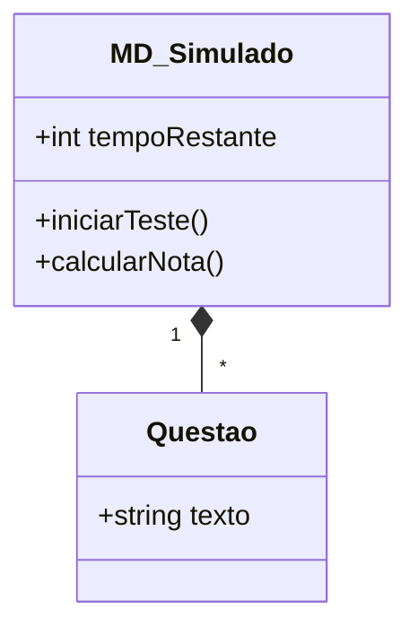
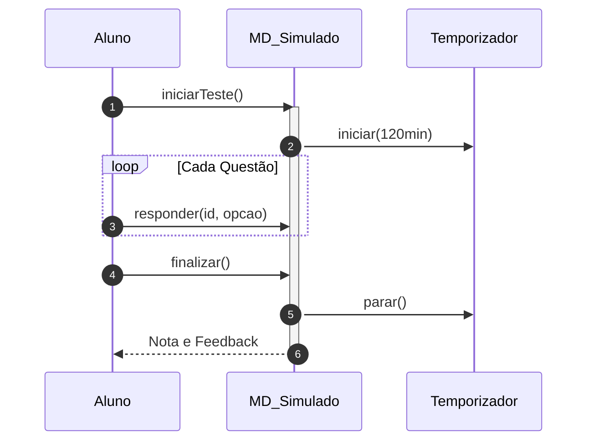

# 📘 Guia de Modelagem: Realizar Simulado ENADE

## 🎯 Objetivo do Caso de Uso
Treinamento intensivo com tempo controlado e questões de exames oficiais.

> [!TIP]
> Dica Astah: No diagrama de sequência, use um 'Fragmento Opt' para o caso de o tempo esgotar.

## 🚀 Tutorial de Criação Passo a Passo (Astah)

### 1️⃣ Criando o Diagrama de Classe
1. No Menu Superior, vá em **Projeto** > **Árvore de Estrutura**.
2. Clique com o botão direito e selecione **Adicionar Diagrama** > **Diagrama de Classe**.
3. Arraste as classes para a área de desenho:
   - [ ] Criar **MD_Simulado**.
   - [ ] Criar **Questao**.
   - [ ] Criar **Atributo: tempoRestante: int**.
4. Adicione os **Atributos** e **Métodos** clicando com o botão direito na classe.
5. Use as ferramentas de **Associação, Dependência ou Herança** para ligar as classes conforme a referência abaixo.

### 2️⃣ Criando o Diagrama de Sequência
1. Clique com o botão direito no Caso de Uso (na Árvore) e selecione **Adicionar Diagrama** > **Diagrama de Sequência**.
2. Adicione os **Participantes** (Linhas de Vida) no topo da tela.
3. Desenhe as setas de mensagem seguindo rigorosamente esta ordem:
   - [ ] 1. **Aluno -> MD_Simulado: iniciarTeste()**
   - [ ] 2. **MD_Simulado -> MD_Simulado: calcularNota()**
   - [ ] 3. **Simulado -->> Aluno: Resultado Final**
4. Lembre-se de adicionar as **Barras de Ativação** clicando sobre a linha de vida onde houver processamento.

---

## 📊 Referência Visual (Padrão PT-BR)
### Diagrama de Classe

### Diagrama de Sequência

---
*Manual técnico gerado em Português para conformidade com o PIM III.*