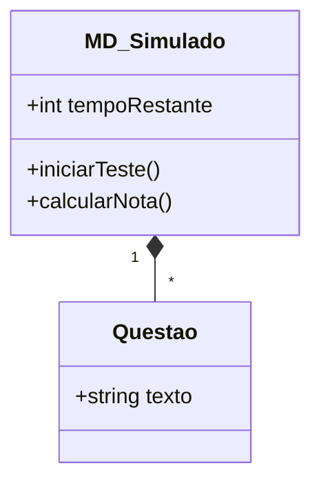
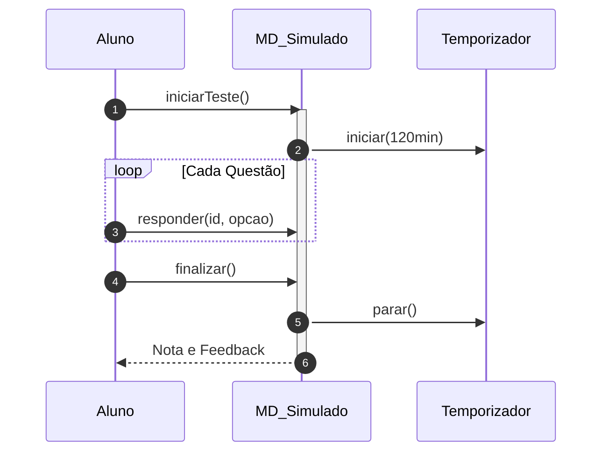

# 📘 Guia de Modelagem Detalhado: Realizar Simulado ENADE

## 🎯 Objetivo
Treinamento intensivo com tempo controlado e questões de exames oficiais.

> [!IMPORTANT]
> Dica Astah: Utilize o 'Combined Fragment' do tipo 'Loop' para as questões e 'Opt' para o estouro de tempo.

## 🚀 Tutorial de Execução Passo a Passo no Astah

### 1️⃣ Construindo o Diagrama de Classe (O QUE criar)
Siga esta ordem exata para garantir a consistência:
   - [ ] 1. **Crie 'MD_Simulado' e 'Questao'.**
   - [ ] 2. **Ligue-as com uma 'Composição' (losango preto no Simulado).**
   - [ ] 3. **Em 'MD_Simulado', adicione '+ tempoRestante: int' e '+ calcularNota()'.**

**Como conectar?** Utilize as ferramentas de ligação na barra lateral do Astah. Se for Herança, procure pelo ícone de triângulo. Se for Dependência, use a linha tracejada.

### 2️⃣ Construindo o Diagrama de Sequência (COMO o processo flui)
Desenhe a interação temporal entre as classes:
   - [ ] 1. **O Aluno inicia o Simulado.**
   - [ ] 2. **O Simulado aciona um 'Temporizador' para controlar os 120 minutos.**
   - [ ] 3. **Dentro de um 'Loop', o Aluno responde cada questão.**
   - [ ] 4. **Ao final, o Simulado desliga o cronômetro e devolve a Nota Final.**

**Dica Visual:** No Astah, as mensagens de retorno (setas tracejadas) são configuradas nas propriedades da mensagem enviada ou desenhadas separadamente.

---

## 📊 Referência Visual (Modelo Final)
### Diagrama de Classe

### Diagrama de Sequência

---
*Este guia foi projetado para ser infalível. Siga os passos acima e sua modelagem estará tecnicamente perfeita.*