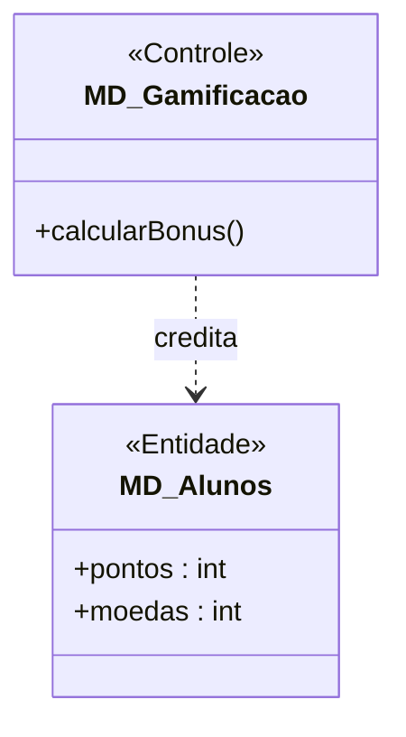
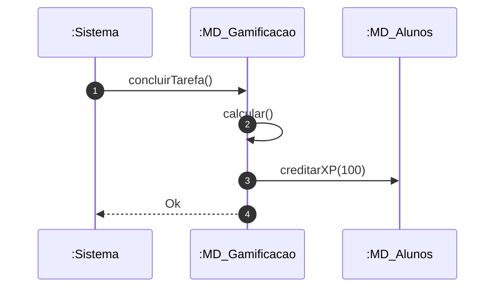

# 📘 Guia de Modelagem Astah (Fiel à v10.x): Atribuir XP e Moedas

## 🎯 Objetivo
Motor de recompensas.

> [!IMPORTANT]
> Dica Astah: Gamificacao é um <<Controle>>.

## 🚀 Tutorial Passo a Passo Detalhado (Interface Astah)

### 1️⃣ Diagrama de Classe (Estrutura)
   - [ ] 1. **Crie 'MD_Gamificacao' (<<Controle>>) e 'MD_Alunos'.**
   - [ ] 2. **Alunos: '+ pontos : int', '+ moedas : int'.**
   - [ ] 3. **Dependência de Gamificação para Alunos.**

**Como configurar no Astah:** Para adicionar o Estereótipo (ex: <<Entidade>>), selecione a classe, vá na aba **Stereotype** (na base da tela) e clique em **Add**.

### 2️⃣ Diagrama de Sequência (Processo)
   - [ ] 1. **Sistema notifica :MD_Gamificacao.**
   - [ ] 2. **Gamificação calcula bônus.**
   - [ ] 3. **Gamificação chama 'creditarXP()' no Aluno.**

**Dica de Notação:** Note que os nomes das Linhas de Vida agora começam com dois pontos (ex: `:Controlador`), indicando que são instâncias anônimas da classe.

---

## 📊 Referência Visual (Estilo Astah UML)
### Diagrama de Classe

### Diagrama de Sequência

---
*Este manual foi otimizado para a versão 10.1.0 do Astah UML.*