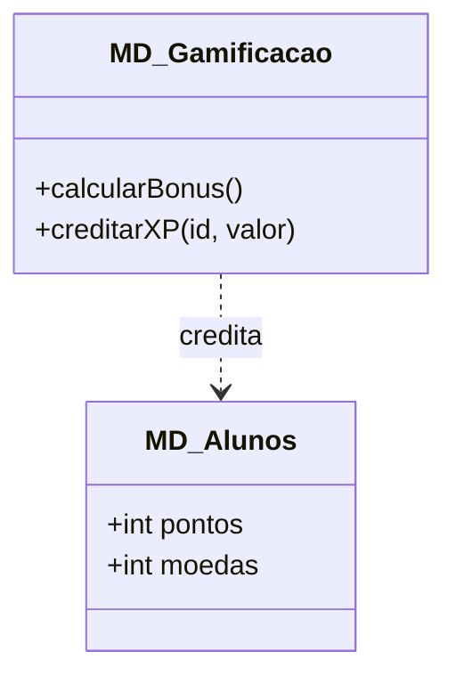
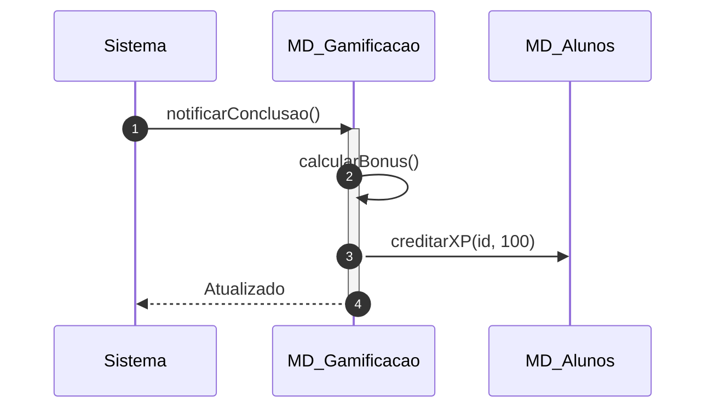

# 📘 Guia de Modelagem Detalhado: Atribuir XP e Moedas

## 🎯 Objetivo
Motor de recompensas automático baseado na conclusão de atividades.

> [!IMPORTANT]
> Dica Astah: A dependência aqui mostra que a Gamificação 'atualiza' o Aluno.

## 🚀 Tutorial de Execução Passo a Passo no Astah

### 1️⃣ Construindo o Diagrama de Classe (O QUE criar)
Siga esta ordem exata para garantir a consistência:
   - [ ] 1. **Crie 'MD_Gamificacao' e 'MD_Alunos'.**
   - [ ] 2. **Em 'MD_Alunos', certifique-se de ter os atributos '+ pontos' e '+ moedas'.**
   - [ ] 3. **Desenhe uma 'Dependência' de MD_Gamificacao para MD_Alunos.**

**Como conectar?** Utilize as ferramentas de ligação na barra lateral do Astah. Se for Herança, procure pelo ícone de triângulo. Se for Dependência, use a linha tracejada.

### 2️⃣ Construindo o Diagrama de Sequência (COMO o processo flui)
Desenhe a interação temporal entre as classes:
   - [ ] 1. **O Sistema notifica o motor de 'MD_Gamificacao' sobre uma tarefa concluída.**
   - [ ] 2. **O motor executa o cálculo de bônus internamente ('calcularBonus').**
   - [ ] 3. **O motor chama 'creditarXP(valor)' no objeto Aluno correspondente.**

**Dica Visual:** No Astah, as mensagens de retorno (setas tracejadas) são configuradas nas propriedades da mensagem enviada ou desenhadas separadamente.

---

## 📊 Referência Visual (Modelo Final)
### Diagrama de Classe

### Diagrama de Sequência

---
*Este guia foi projetado para ser infalível. Siga os passos acima e sua modelagem estará tecnicamente perfeita.*