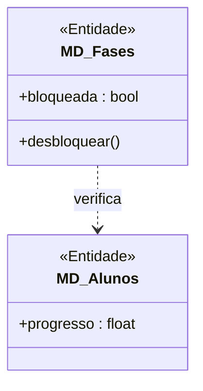
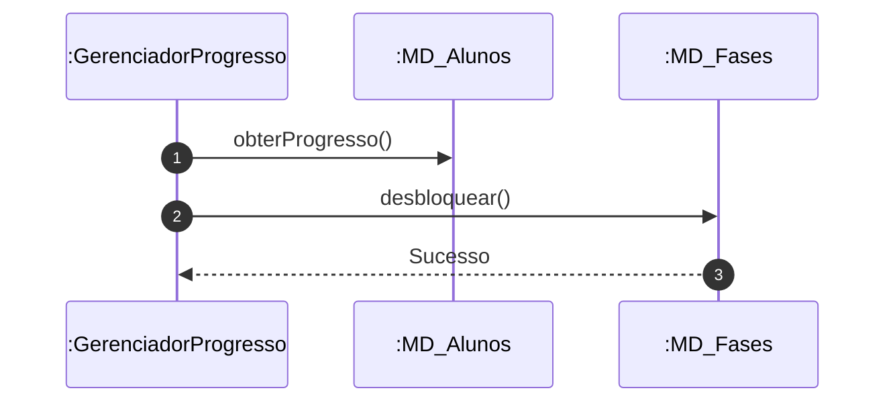

# 📘 Guia de Modelagem Astah (Fiel à v10.x): Desbloquear Fases e Módulos

## 🎯 Objetivo
Progressão condicionada.

> [!IMPORTANT]
> Dica Astah: Use Dependência para mostrar verificação de progresso.

## 🚀 Tutorial Passo a Passo Detalhado (Interface Astah)

### 1️⃣ Diagrama de Classe (Estrutura)
   - [ ] 1. **Crie 'MD_Fases' com '+ bloqueada : bool'.**
   - [ ] 2. **Crie 'GerenciadorProgresso' (<<Controle>>).**
   - [ ] 3. **Dependência do Gerenciador para Alunos e Fases.**

**Como configurar no Astah:** Para adicionar o Estereótipo (ex: <<Entidade>>), selecione a classe, vá na aba **Stereotype** (na base da tela) e clique em **Add**.

### 2️⃣ Diagrama de Sequência (Processo)
   - [ ] 1. **Gerenciador pede progresso ao Aluno.**
   - [ ] 2. **Se ok, chama 'desbloquear()' na :MD_Fases.**
   - [ ] 3. **Fase muda estado para liberada.**

**Dica de Notação:** Note que os nomes das Linhas de Vida agora começam com dois pontos (ex: `:Controlador`), indicando que são instâncias anônimas da classe.

---

## 📊 Referência Visual (Estilo Astah UML)
### Diagrama de Classe

### Diagrama de Sequência

---
*Este manual foi otimizado para a versão 10.1.0 do Astah UML.*