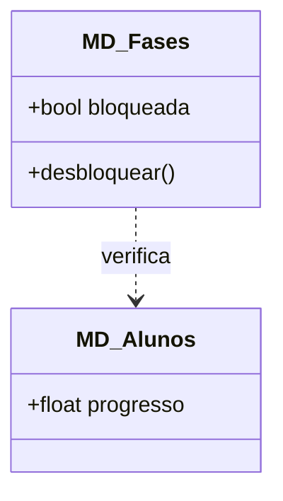
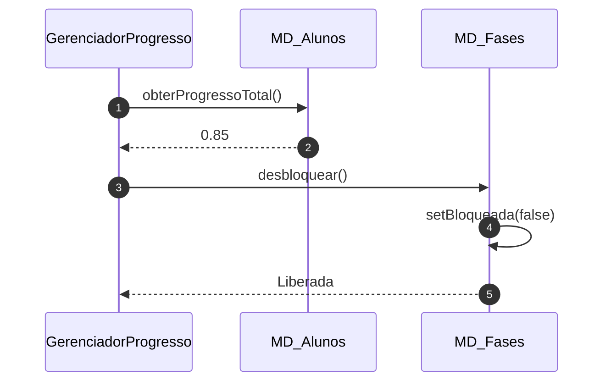

# 📘 Guia de Modelagem Detalhado: Desbloquear Fases e Módulos

## 🎯 Objetivo
Progressão de conteúdo condicionada ao desempenho nas fases anteriores.

> [!IMPORTANT]
> Dica Astah: Use a Dependência para mostrar que as Fases dependem do progresso do Aluno.

## 🚀 Tutorial de Execução Passo a Passo no Astah

### 1️⃣ Construindo o Diagrama de Classe (O QUE criar)
Siga esta ordem exata para garantir a consistência:
   - [ ] 1. **Crie 'MD_Fases' com '+ bloqueada: booleano' e '+ desbloquear()'.**
   - [ ] 2. **Crie 'GerenciadorProgresso' (Controle).**
   - [ ] 3. **Desenhe uma 'Dependência' do Gerenciador para MD_Alunos e MD_Fases.**

**Como conectar?** Utilize as ferramentas de ligação na barra lateral do Astah. Se for Herança, procure pelo ícone de triângulo. Se for Dependência, use a linha tracejada.

### 2️⃣ Construindo o Diagrama de Sequência (COMO o processo flui)
Desenhe a interação temporal entre as classes:
   - [ ] 1. **O GerenciadorProgresso solicita ao Aluno o seu 'obterProgressoTotal()'.**
   - [ ] 2. **Se o valor for satisfatório, o Gerenciador chama 'desbloquear()' na classe MD_Fases.**
   - [ ] 3. **A classe Fases altera seu estado interno de 'bloqueada' para falso.**

**Dica Visual:** No Astah, as mensagens de retorno (setas tracejadas) são configuradas nas propriedades da mensagem enviada ou desenhadas separadamente.

---

## 📊 Referência Visual (Modelo Final)
### Diagrama de Classe

### Diagrama de Sequência

---
*Este guia foi projetado para ser infalível. Siga os passos acima e sua modelagem estará tecnicamente perfeita.*