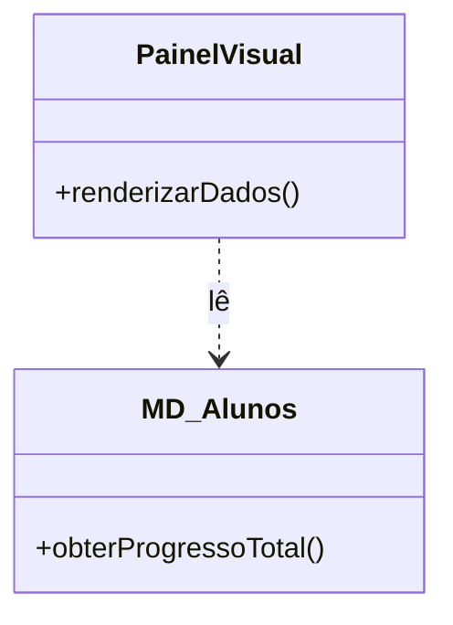
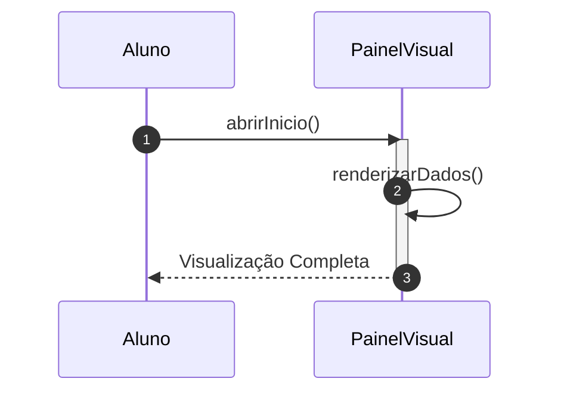

# 📘 Guia de Modelagem Detalhado: Visualizar Painel de Progresso

## 🎯 Objetivo
Hub central onde o aluno acompanha sua jornada e conquistas.

> [!IMPORTANT]
> Dica Astah: O PainelVisual é uma classe de 'Fronteira'. Use o estereótipo <<boundary>> no Astah.

## 🚀 Tutorial de Execução Passo a Passo no Astah

### 1️⃣ Construindo o Diagrama de Classe (O QUE criar)
Siga esta ordem exata para garantir a consistência:
   - [ ] 1. **Crie 'PainelVisual' e 'MD_Alunos'.**
   - [ ] 2. **Em 'PainelVisual', adicione o método '+ renderizarDados()'.**
   - [ ] 3. **Desenhe uma 'Dependência' do Painel para o Aluno (leitura de dados).**

**Como conectar?** Utilize as ferramentas de ligação na barra lateral do Astah. Se for Herança, procure pelo ícone de triângulo. Se for Dependência, use a linha tracejada.

### 2️⃣ Construindo o Diagrama de Sequência (COMO o processo flui)
Desenhe a interação temporal entre as classes:
   - [ ] 1. **O Aluno abre a tela de início ('abrirInicio').**
   - [ ] 2. **O PainelVisual executa internamente a renderização dos componentes gráficos.**
   - [ ] 3. **O Painel solicita ao Aluno os dados de progresso e exibe tudo na tela.**

**Dica Visual:** No Astah, as mensagens de retorno (setas tracejadas) são configuradas nas propriedades da mensagem enviada ou desenhadas separadamente.

---

## 📊 Referência Visual (Modelo Final)
### Diagrama de Classe

### Diagrama de Sequência

---
*Este guia foi projetado para ser infalível. Siga os passos acima e sua modelagem estará tecnicamente perfeita.*