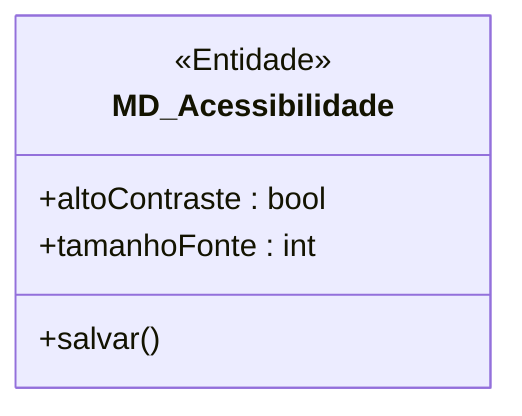
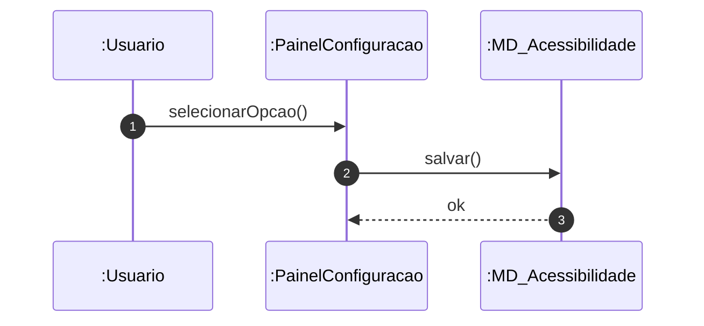

# 📘 Guia de Modelagem Astah (Fiel à v10.x): Ajustar Acessibilidade

## 🎯 Objetivo
Personalização.

> [!IMPORTANT]
> Dica Astah: MD_Acessibilidade é uma <<Entidade>>.

## 🚀 Tutorial Passo a Passo Detalhado (Interface Astah)

### 1️⃣ Diagrama de Classe (Estrutura)
   - [ ] 1. **Crie 'MD_Acessibilidade' com '+ altoContraste : bool' e '+ tamanhoFonte : int'.**
   - [ ] 2. **Método: '+ salvar()'.**

**Como configurar no Astah:** Para adicionar o Estereótipo (ex: <<Entidade>>), selecione a classe, vá na aba **Stereotype** (na base da tela) e clique em **Add**.

### 2️⃣ Diagrama de Sequência (Processo)
   - [ ] 1. **Usuario interage com :PainelConfiguracao.**
   - [ ] 2. **Painel envia 'salvar()' para :MD_Acessibilidade.**
   - [ ] 3. **Interface atualiza.**

**Dica de Notação:** Note que os nomes das Linhas de Vida agora começam com dois pontos (ex: `:Controlador`), indicando que são instâncias anônimas da classe.

---

## 📊 Referência Visual (Estilo Astah UML)
### Diagrama de Classe

### Diagrama de Sequência

---
*Este manual foi otimizado para a versão 10.1.0 do Astah UML.*