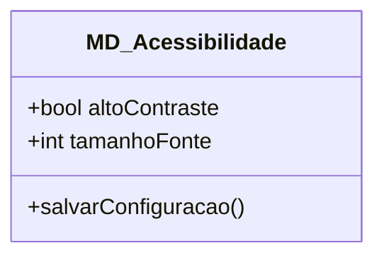
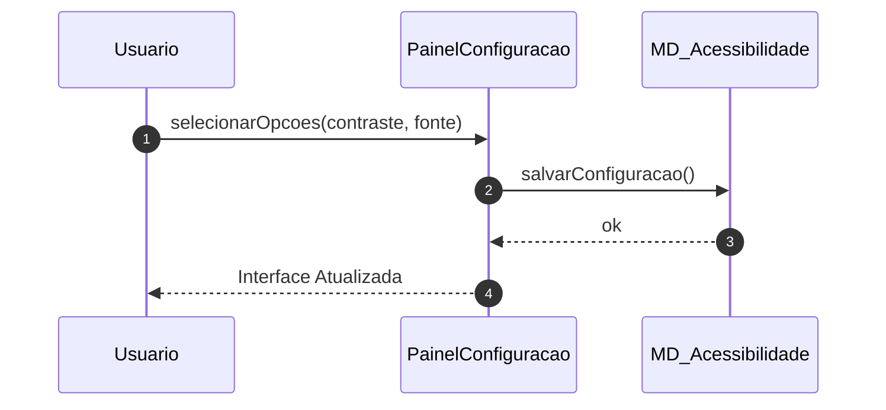

# 📘 Guia de Modelagem Detalhado: Ajustar Acessibilidade

## 🎯 Objetivo
Personalização da interface para garantir inclusão e conforto visual.

> [!IMPORTANT]
> Dica Astah: Adicione atributos como 'tamanhoFonte' com valores padrão (ex: 12).

## 🚀 Tutorial de Execução Passo a Passo no Astah

### 1️⃣ Construindo o Diagrama de Classe (O QUE criar)
Siga esta ordem exata para garantir a consistência:
   - [ ] 1. **Crie 'MD_Acessibilidade' com os atributos '+ altoContraste: bool' e '+ tamanhoFonte: int'.**
   - [ ] 2. **Adicione o método '+ salvarConfiguracao()'.**
   - [ ] 3. **Não são necessárias associações externas para este UC isolado.**

**Como conectar?** Utilize as ferramentas de ligação na barra lateral do Astah. Se for Herança, procure pelo ícone de triângulo. Se for Dependência, use a linha tracejada.

### 2️⃣ Construindo o Diagrama de Sequência (COMO o processo flui)
Desenhe a interação temporal entre as classes:
   - [ ] 1. **O Usuario interage com o 'PainelConfiguracao' escolhendo as opções.**
   - [ ] 2. **O Painel envia o comando 'salvarConfiguracao()' para a classe MD_Acessibilidade.**
   - [ ] 3. **A interface é atualizada instantaneamente para refletir as novas escolhas.**

**Dica Visual:** No Astah, as mensagens de retorno (setas tracejadas) são configuradas nas propriedades da mensagem enviada ou desenhadas separadamente.

---

## 📊 Referência Visual (Modelo Final)
### Diagrama de Classe

### Diagrama de Sequência

---
*Este guia foi projetado para ser infalível. Siga os passos acima e sua modelagem estará tecnicamente perfeita.*